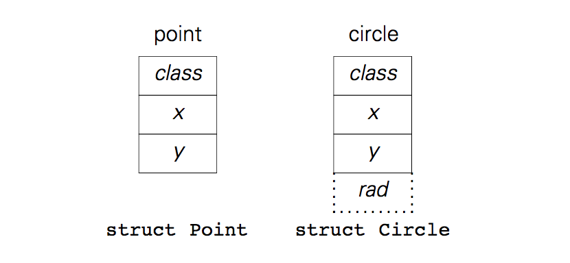

### 4 继承 代码复用和改进

##### <a name="4.1">4.1 一个超类——点</a>

我们将在本章里开始做一个简单的绘画程序。下面的是一个快速的方法来测试一个我们想要的类：

```
#include "Point.h"
#include "new.h"

int main (int argc, char ** argv)
{   void * p;
    
    while (* ++ argv)
    {   switch (** argv) {
        case 'p':
            p = new(Point, 1, 2);
            break;
        default:
            continue;
        }
        draw(p);
        move(p, 10, 20);
        draw(p);
        delete(p);
    }
    return 0;
}
```

对于每一个 `p` 开头的命令行参数，我们都会创建一个点，绘制，然后移动，再绘制，最后删除。ANSI-C 没有用于图形输出的标准函数。不过，如果我们一定要生成一个图片的话，我们可以输出能够被 Kernighan 的 *pic*[Ker82] 识别的文本：

```
$ points p
"." at 1,2
"." at 11,22
```

坐标对于测试不重要——按照一个商业和面向对象的说法：重要的是信息。

我们能用一个点做什么呢？`new()` 会生成一个点，构造器需要初始坐标作为 `new()` 的额外参数。照常，`delete()` 会回收我们的点，按照惯例，我们会有一个析构函数。

`draw()` 负责把点显示出来。我们要用其他的图形对象——所以测试程序里用了 `switch`——我们将为 `draw()` 实现动态链接。

`move()` 根据参数的值改变点的坐标。对于每一个图形对象，我们若是根据它的参考点来做的话，我们将可以通过对这个点执行 `move()` 来移动它。因此，对于 `move()`，我们不需要用动态链接。

##### <a name="4.2">4.2 超类的实现——点</a>

*Point.h* 里的抽象数据类型接口包含了以下内容：

```
extern const void * Point;               /* new(Point, x, y); */
void move (void * point, int dx, int dy);
```

我们可以回收利用[第 2 章](#2.1)的几个 `new.?` 文件，我们去除大部分方法，然后在 *new.h* 中添加 `draw()`：

```
void * new (const void * class, ...);
void delete (void * item);
void draw (const void * self);
```

*new.r* 里的类型描述符 **struct Class** 应该和 *new.h* 里的方法声明对应：

```
struct Class {
    size_t size;
    void * (* ctor) (void * self, va_list * app);
    void * (* dtor) (void * self);
    void (* draw) (const void * self);
};
```

选择器函数 `draw()` 在 *new.c* 里实现。它取代了 [2.3 部分](#2.3) 里引入的 *differ()* 等选择器函数，并用相同的风格编写：

```
void draw (const void * self)
{   const struct Class * const * cp = self;

    assert(self && * cp && (* cp) —> draw);
    (* cp) —> draw(self);
}
```

做好这些准备工作后，我们可以将工作转向点的实现文件 *Point.c* 了。面向对象再一次帮我们准确地识别了要做的事情：我们要决定表现方式，实现一个构造函数，一个析构函数，动态链接的 *draw()* 函数和静态链接的 *move()* 函数（这只是一个普通函数）。假如我们只支持二维，笛卡尔坐标系，我们用下面明显的表达方式：

```
struct Point {
    const void * class;
    int x, y;        /* coordinates */
};
```

构造函数必须要初始化 `.x` 和 `.y` 坐标——现在这些已经是常规操作了：

```
static void * Point_ctor (void * _self, va_list * app)
{   struct Point * self = _self;

    self —> x = va_arg(* app, int);
    self —> y = va_arg(* app, int);
    return self;
}
```

我们并不需要析构函数，因为没有需要在 `delete()` 删除点之前释放的资源。我们在 `Point_draw()` 函数里用 *pic* 可以识别的方式打印了当前的坐标：

```
static void Point_draw (const void * _self)
{   const struct Point * self = _self;
    printf("\".\" at %d,%d\n", self —> x, self —> y);
}
```

按这种方式的话，我们就能支持所有动态链接的方法了，我们可以定义类型描述符，空指针代表不存在的析构函数：

```
static const struct Class _Point = {
    sizeof(struct Point), Point_ctor, 0, Point_draw
};

const void * Point = & _Point;
```

`move()` 不是动态链接的，所以我们略去了 `static` 来从 *Point.c* 导出它，并且我们没有在它的名字前面加上类名 **Point**：

```
void move (void * _self, int dx, int dy)
{   struct Point * self = _self;

    self —> x += dx, self —> y += dy;
}
```

最终，我们在 *Point.?* 里实现了点，在 *new.?* 里支持动态链接。

##### <a name="4.3">4.3 继承——圆</a>

圆不过就是个大一些的点：除了中心坐标，它还需要一个半径。画的过程稍微有点不同，但若要移动它，我们只需要修改中心的坐标。

然后我们就可以打开编辑器开始复用代码了。我们把实现点的代码复制一份，然后把圆和点的不同之处改一下。`struct Circle` 里加了一个东西：

```
int rad;
```

这部分在构造函数里初始化：

```
self —> rad = va_arg(* app, int);
```

并在 ` Circle_draw()` 里使用：

```
printf("circle at %d,%d rad %d\n",
    self —> x, self —> y, self —> rad);
```

`move()` 有点不太好搞。对于点和圆来说，要做的操作没什么区别：把移动的参数加到坐标上。不过，一个是要在 `struct Point` 上调用 `move()`，另一个则是要在 `struct Circle` 上调用。如果 `move()` 是动态链接的，我们可以提供两个不同的函数来做同一件事，但还有一个更好的办法。想想点和圆的表现方式的样子：



从图里能看出来每个圆都是以一个点开始。如果我们通过在 `struct Point` 后面添加内容来得到 `struct Circle` 的话，我们就可以把一个圆传给 `move()`，因为它的表达方式里开始的那一部分和点的一样，这正是 `move()` 要的，也是 `move()` 唯一能修改的地方。下面的方法可以确保圆的起始部分和点的一样：

```
struct Circle { const struct Point _; int rad; };
```

我们让派生的结构以我们要继承的基础结构的拷贝开始。信息隐藏要求我们决不能直接访问基础结构，所以我们用了一个几乎不可见的下划线作为它的名字，并且把它声明为 `const` 来防止意外的赋值。

这就是 *简单继承* 的所有内容：仅仅通过扩展超类结构的长度，*子类*从*超类*（或*基类*）派生而来。

由于子类对象（圆）的表示方式和超类对象（点）的表示方式相似，圆可以假装为点——圆的表示方式的初始地址处真的有一个点的表示方式。

把圆传给 `move()` 很合理：子类继承了父类的方法，因为这些方法只作用于子类结构和父类结构中相同的部分，这些方法也正是为这些相同的部分而写的。把圆当作点来传递意味着把 `struct Circle` 转为 `struct Point`。我们把这称为从子类到超类的*向上转型*——在 ANSI-C 中只能借助显示的转换操作符或通过中间的 `void *` 值来实现。

然而，把点传给一个本来要给给圆用的函数通常是不合理的，比如 `Circle_draw()`：只有在一个点本来就是一个圆的情况下，把 `struct Point *` 转为 `struct Circle *` 才可行。我们把这个过程称为从超类到子类的*向下转型*——也要用显示的转换或 `void *` 值，但只适用于结构是以子类开始的对象的指针。

##### <a name="4.4">4.4 链接和继承</a>

`move()` 不是动态链接的，也没有使用动态链接的方法来做它的工作。虽然我们可以把点和圆都传给 `move()`，它并不是一个真正的多态函数：`move()` 对不同类型的对象做的事情是一样的，不管除了坐标还加什么内容，它总是把参数和坐标相加。

这和像 `draw()` 这样的动态链接的方法是不同的。我们再来看一下之前的那个图，我们这次把类型描述显示地显示了出来：


在把圆向上转型为点时，我们没有改变圆的状态。也就是说，虽然我们把圆的表现形式 `struct Circle` 当成 `struct Point` 来看，我们并没有改变它的内容。相应地，把圆看作点时，它的类型描述还是 `Circle`，因为它的 `.class` 部分里的指针没有变。`draw()` 是一个选择器函数，也就是说，它会把传进来的任何参数都当做 `self`，然后找到 `.class` 代表的类型描述，并调用存储的绘制函数。

子类从超类继承静态连接的方法——这些方法在子类对象和超类对象的相同部分上执行。子类可以选择提供自己的方法来代替超类里动态链接的方法。如果发生了继承，也就是说，没有重写的话，超类里动态链接的方法会像静态链接的方法一样执行，并修改子类对象里的父类部分。如果重写了，子类自己的动态链接的方法可以访问到子类对象的完整内容，也就是说，对于圆，`draw()` 会调用 `Circle_draw()`，这个方法在画圆的时候能够知道半径大小。 

##### <a name="4.5">4.5 静态和动态链接</a>

子类从超类继承静态链接的方法，并可以选择继承或者重写动态链接的方法。看看下面 `move()` 和 `draw()` 的声明：

```
void move (void * point, int dx, int dy);
void draw (const void * self);
```

我们看不出来两个声明的链接方式，尽管 `move()` 的实现直接做了它的工作而 `draw()` 是个在运行时追溯动态链接的选择器函数。唯一的不同之处是，我们把静态链接的方法（比如 `move()`）声明为 *Point.h* 里的抽象数据类型接口的一部分，同时把动态链接的方法（比如 `draw()`）和内存管理相关的接口声明在 *new.h* 里，因为我们决定在 *new.c* 里实现选择器函数。

静态链接效率更高，因为 C 编译器可以用直接地址来编写子程序的调用，但像 `move()` 这样的函数不能被子类重写。动态链接更灵活，代价是间接调用——我们已经知道了调用像 `draw()` 这样的函数、检查参数、寻找和调用合适方法的代价。我们可以像下面一样利用宏来放弃检查并减少代价：

```
#define draw(self) \
        ((* (struct Class **) self) —> draw (self))
```

（ ANSI-C 不会递归展开宏，防止一个宏可能隐藏一个相同名称的函数。）

但如果参数有副作用的话宏会带来问题，并且没有好用的技术来操纵宏的参数列表。此外，宏要求 `struct Class` 的声明，而我们一直只让它对类的实现可见，而不是整个程序。

不幸的是，我们在设计超类的时候决定了很多事情。虽然调用方法的函数没变，还是要做大量的编辑，可能要在很多类里去把函数的定义从静态转为多态或者反过来。从[第七章](#7)开始，我们将会使用一个简易的预编译程序简化编码，但就算那样，切换链接方式很容易出错。
如果不确定用哪种方式，用动态链接应该比静态链接更好一些，尽管动态链接的效率低一些。泛型函数提供了一种概念上的抽象，它有助于减少项目里面需要记住名字的函数的数量。要是在实现了所有的类之后，发现一个动态链接的方法没有被重写过，可以用它唯一的实现替换它的选择器，就算浪费了它在 `struct Class` 里的位置，这要比拓展类型描述和纠正所有的初始化过程省事。

##### <a name="4.6">4.6 可见性和访问函数</a>

我们现在可以实现 `Circle_draw()` 了。为了实现信息隐藏，我们基于“需要知道”的原则对每一个类都用三个文件。*Circle.h* 包含抽象数据类型接口；子类引入超类的接口文件来使得要被继承的方法可见：

```
#include "Point.h"
extern const void * Circle;        /* new(Circle, x, y, rad) */
```

接口文件 *Circle.h* 被应用程序的代码引入来实现这个类；我们会防止多次引用它。

圆的表示方式被声明在第二个文件里，*Circle.r*。子类会引入超类的表示方式文件，以便我们通过拓展超类来得到子类的表示方式：

```
#include "Point.r"
struct Circle { const struct Point _; int rad; };
```

子类需要超类的表示方式来实现继承：`struct Circle` 包含了一个 `const struct Point`。当然，点不是常量——`move()` 会修改它的坐标——但 `const` 修饰符可以防止意外覆盖该部分。表示方式的文件 *Circle.h* 只在实现该类的时候才被引用；我们会防止多次引用它。

最后，圆的实现被定义在源文件 *Circle.c* 中，该文件引用了该类和对象管理相关的接口和表示方式文件：

```
#include "Circle.h"
#include "Circle.r"
#include "new.h"
#include "new.r"

static void Circle_draw (const void * _self)
{    const struct Circle * self = _self;
     printf("circle at %d,%d rad %d\n",
         self —> _.x, self —> _.y, self —> rad);
}
```

在 `Circle_draw()` 中，我们通过深入子类部分并使用“不可见的名字” _ 读取了点的信息。从信息隐藏的角度来看，这不是个好注意。虽然读取坐标不太会导致什么严重的问题，但我们不能保证在其他情况下子类的实现不会取巧并直接修改超类部分，这就带来了潜在的问题。

考虑到效率，我们最好从子类直接访问到超类的部分，而信息隐藏又要求超类尽量对子类隐藏自己的表示方式。如果我们选择后者，我们应该提供*访问函数*和*修改函数*来访问和修改超类中允许子类读取和修改的的部分。

访问函数和修改函数是静态链接的方法。如果把它们声明在超类的表示文件里（这个文件只被子类的实现文件引入），我们可以使用宏，因为宏只使用每个参数一次的话副作用不是问题。作为示范，我们在 *Point.r* 里定义了下面的用于访问的宏 *：

\* 在 ANSI-C 中，带参数的宏只会在宏的名字出现在左括号前面时才会展开。否则，宏的名字和任何其他的标识符行为一样。

```
#define x(p)    (((const struct Point *)(p)) —> x)
#define y(p)    (((const struct Point *)(p)) —> y)
```

这些宏适用于指向任何以 `struct Point` 开始的对象的指针，也就是说，任何点的子类的对象。这个技术的目的是把指针向上转型为超类后使用感兴趣的内容。转型的时候， `const` 用于防止对结果赋值。如果去掉 `const` 的话：

```
#define x(p)    (((struct Point *)(p)) —> x)
```

调用宏 `x(p)` 会产生一个左值，它可以被赋值。下面的宏定义是个更好的修改函数：

```
#define set_x(p,v)    (((struct Point *)(p)) —> x = (v))
```

它支持赋值。

在子类的实现外部，我们只能使用访问和修改的函数的静态链接方法。我们用不了宏，因为超类的内部表示方式对宏不可见。信息隐藏正是通过避免把表示文件 *Point.r* 给应用程序引用做到的。

宏定义说明了一旦类的表示文件可以被访问到，信息隐藏很容易就会被破坏。有一种更好的隐藏 *struct Point* 的方法。在超类的实现里我们用正常的定义：

```
struct Point {
    const void * class;
    int x, y;            /* coordinates */
};
```

对于子类的实现，我们提供下面这种不透明的方式：

```
struct Point {
    const char _ [ sizeof( struct {
        const void * class;
        int x, y;            /* coordinates */
    })];
};
```

这个结构体的大小和之前一样，但由于内容被隐藏在一个匿名的内部结构里，我们不能读也不能写。需要注意的是，两个声明必须包含一致的内容，这在没有预处理器的情况下很难维护。

##### <a name="4.7">4.7 子类的实现——圆</a>

我们可以写圆的完整实现了，我们选用前面讨论的技术里最青睐的。面向对象规定我们要有一个构造函数、可选的析构函数、`Circle_draw()` 和一个类型描述 `Circle` 来把所有内容放一起。为了测试我们的方法，我们在 [4.1 部分](#4.1) 的测试程序里引入 *Circle.h* 并在 `switch` 里添加下面的内容：

```
case 'c':
    p = new(Circle, 1, 2, 3);
    break;
```

然后我们可以看到测试程序输出下面的内容：

```
$ circles p c
"." at 1,2
"." at 11,22
circle at 1,2 rad 3
circle at 11,22 rad 3
```

圆的构造函数接收三个参数：先是圆的点部分的坐标，然后是半径。初始化点的部分是点的构造函数的事情。它用掉了 `new()` 的参数列表里部分的参数。圆的构造函数用剩下的参数初始化半径。

子类的构造函数要先让超类的构造函数做初始化工作来把普通的内存变为超类的对象。超类的构造函数做完后，子类的构造函数完成初始化把超类对象转为子类对象。

对圆来说，我们需要调用 `Point_ctor()`。和所有动态链接的方法一样，这个函数是静态的并被隐藏在 *Point.c* 里。不过，通过 *Circle.c* 里可见的类型描述符 `Point`，我们还是可以访问到这个函数：

```
static void * Circle_ctor (void * _self, va_list * app)
{   struct Circle * self =
        ((const struct Class *) Point) —> ctor(_self, app);

    self —> rad = va_arg(* app, int);
    return self;
}
```

有一件事应该清楚了，那就是我们为什么要把参数列表指针地址 `app` 传给每个构造函数，而不是传递 `va_list` 值自己：`new()` 调用子类的构造函数，子类的构造函数会调用超类的构造函数，等等。最上层的构造函数最先执行，它从传给 `new()` 的参数列表的最左边取参数。剩下的参数再让下一个子类使用，如此等等。到最后，最右边的参数会被最终的子类使用，也就是让被 `new()` 直接调用的构造函数使用。

析构函数最好按完全相反的顺序执行：`delete()` 调用子类的构造函数。它应该先销毁自己的资源，然后调用它的直接超类的析构函数来销毁下一部分资源，等等。超类的构造函数比子类的先执行，析构函数的顺序相反，子类的比超类的先执行，圆的部分比点的部分先执行。不过，在这个例子里不需要做什么。

我们之前已经写过 `Circle_draw()` 了。我们用了可见的内容，并按下面的方式写了表示文件 *Point.r*：

```
struct Point {
    const void * class;
    int x, y;           /* coordinates */
};


#define x(p)    (((const struct Point *)(p)) —> x)
#define y(p)    (((const struct Point *)(p)) —> y)
```

现在我们可以在 `Circle_draw()` 里使用用于访问的宏了：

```
static void Circle_draw (const void * _self)
{   const struct Circle * self = _self;
    printf("circle at %d,%d rad %d\n",
        x(self), y(self), self —> rad);
}
```

`move()` 是静态链接的，并从点的实现里继承而来。通过定义类型描述，它是 *Circle.c* 唯一全局可见的部分，我们确定了圆的实现：

```
static const struct Class _Circle = {
    sizeof(struct Circle), Circle_ctor, 0, Circle_draw
};

const void * Circle = & _Circle;
```

通过使用类的接口、表示和实现文件，我们貌似有了一个可行的方式来发布程序，但在点和圆的例子里有个问题没说：若一个类似 `Point_draw()` 的动态链接的方法没有在子类里重写，子类的类型描述符需要指向在超类里的实现函数。但为了选择器的规则被遵循，超类里的函数被定义成了 `static`。我们将在[第 6 章](#6.1) 看到这个程序的一个干净的解决方案。作为临时的方案，我们在这种情况下避免使用 `static`，我们在子类的实现文件里声明函数头部，并用函数名称初始化子类的类型描述。

##### <a name="4.8">4.8 总结</a>

超类和子类的对象有些相似，但在行为上不是完全一致。子类对象通常有更复杂的状态和更多的方法——它们是超类对象的特殊版本。

我们一开始通过复制超类对象的表示方式来表示子类对象，也就是说，子类对象是通过在超类对象的最后添加内容表示的。
子类继承了超类的方法：因为子类对象的最前面看起来和超类对象一样，我们可以在把子类对象的指针向上转型后把它看作指向超类对象的指针，我们可以把转型后的这个指针传给超类的方法。为了不使用显示的类型转换，我们把所有方法参数都用 `void *` 声明为泛型指针。

继承算是多态的一种简单形式：超类对象方法接收不同类型的对象，也就是它自己类型的对象和所有子类的对象。然而，由于所有对象都是以超类对象的形式出现，该方法只能作用于对象的超类部分，相应地，它在不同类型的对象上表现没有什么不同。

动态链接的方法可以从超类继承也可以在子类被重写——这由子类的类型描述里的函数指针决定。因此，当在一个对象上调用动态链接的方法时，哪怕要把指针向上转型为某个超类，我们总是要找到方法方法所属对象的真实类型。若某个动态链接方法是由继承而来的，它只能作用于子类对象中的超类部分，因为它不知道子类的存在。要是方法被重写了，子类版本的函数可以访问到整个对象，它还可以通过显示地使用超类的类型描述来调用超类里的方法。

特别地，构造函数应该依次向上调用超类的构造函数直到最顶层的超类，以便每个子类的构造函数只处理自己对超类的扩展部分。子类的析构函数要先释放子类的资源，再调用超类的析构函数，以此类推。构造函数的执行过程是从超类到子类，析构函数的执行顺序搞好相反。

我们的方案有个问题：一般说来，我们不应该从构造函数里调用动态链接的方法，因为对象可能还没完成初始化。`new()` 在构造函数执行之前把最终的类型描述插了进来。因此，如果构造函数在对象上调用动态链接的方法，它可能在它所处的类里找不到那个方法。保险的做法是，在同一个类里，在构造函数里通过使用内部名称来调用，也就是说，对于点的话，调用 `Points_draw()` 而不是 `draw()`。

为了遵循信息隐藏的原则，我们用了三个文件来实现一个类。接口文件包含了抽象数据类型描述，表示文件包含了对象的结构，而实现文件包含了方法的代码并初始化了类型描述。接口文件导入了超类的接口文件，然后被实现代码以及任何应用引入。表示文件导入了超类的表示方法，并只被实现代码导入。

超类的内容不应该在子类里被直接引用到。而是，我们提供静态链接的方法和每个部分需要的修改方法，或者，我们在超类的表示文件里添加合适的宏。使用函数名称让我们更容易发现信息泄露和值被破坏的问题。

##### <a name="4.9">4.9 Is It 还是 Has It？——继承 vs. 聚合</a>

在圆的表示 `struct Circle` 里有个点的表示作为第一部分：

```
struct Circle { const struct Point _; int rad; };
```

我们主动决定不直接访问这一部分内容。相反，当我们想继承的时候，我们从 `Cirlce` 向上转型为 `Point`，然后再使用 `struct Point` 的内容。

还有一种表示圆的方式：圆以聚合的形式包含一个点。我们可以只通过指针来使用对象；因此，圆的这种表示方法大概像下面这样：

```
struct Circle2 { struct Point * point; int rad; };
```

现在圆看起来不再像点了，也就是说，它不能再从 `Point` 继承并复用其方法了。但是，它可以在它的点的部分上调用点的方法；它只是不能在自己身上调用点的方法。

要是一门语言自带继承的语法，区别会更明显。类似的表示方式在 C++ 里看起来像下面这样：

```
struct Circle : Point { int rad; };        // inheritance

struct Circle2 {
    struct Point point;    int rad;        // aggregate
};
```

在 C++ 里不必非得以指针的形式访问对象。

继承，即从超类获得子类，和聚合，即在一个对象里包含一个其他对象，提供了相似的功能。我们可以通过问 *is-it-or-has-it* 来决定具体要使用哪种方式：如果一个新类型的对象和其他类型的对象很像，我们可以用继承来实现新类；要是新类的对象用一个其他类的对象作为自己状态的一部分，我们应该使用聚合。

就点而言，圆就是个大点，这也是我们用继承来实现圆的原因。矩形不太好说：我们可以用一个参考点和边长来描述，也可以用对角线的端点甚至是三个角来描述。只有在有参考点的情况下，矩形才看起来勉强像个点；其他的表示方式只能用聚合。在我们的数学表达式里，我们本可以使用继承从一元操作符得来二元操作符，但这肯定通不过前面的测试。

##### <a name="4.10">4.10 多重继承</a>

由于我们使用的是 ANSI-C，有一点我们回避不了，那就是继承意味着在一个结构的起始位置处包含另一个结构。向上转型是在子类对象上复用超类的方法的关键。通过转换圆的结构里最前面部分的地址，圆可以被向上转型为点，在这过程中地址的值不变。

如果我们在一个结构里包含两个或多个其他结构，并且能在向上转型的过程中做一些地址相关的控制的话，我们就能实现多重继承：一个对象可以看起来像是从几个其它类得来的。这样做的优点看起来是我们不必过于仔细地设计继承关系——我们可以很快地把类堆到一起，想要什么就集成什么。缺点很明显，我们在复用超类的方法前必须向上转型的过程中操纵地址。

事情很快就会变得让人疑惑。想想一个文本和一个矩形，两者都有一个通过继承得来的参考点。我们可以把它们放到一个按钮里——唯一的问题是按钮是应该继承一个参考点还是两个参考点。通过在构造和向上转型的过程中使用些花招，C++ 能做到两种都支持。

我们一切都用 ANSI-C 实现的做法有个很大的优点：它不会对一个事实含糊其辞——继承，多重继承或者其他——总是通过导入实现。不过，导入也可以通过聚合实现。很难说请多重继承是给编程人员做了更多的有益的事还是把语言搞的很复杂从而增加了实现难度。我们会保持简单并继续只使用简单继承。[第 14 章](#14.1) 会讲到一个使用多重继承的原则，库的合并，通常可以通过聚合和消息转发实现。

##### <a name="4.11">4.11 练习</a>

图形编程用到了大量的继承：一个点和一个边长定义了一个正方形；一个点和一对偏移量定义了一个矩形、一个线段或者一个椭圆；一个点和一个包含多对偏移量的数组定义了一个多边形甚至是曲线。在我们实现这些类之前，我们可以通过创建一些更漂亮的点，比如添加一个文本和一个相对位置，或者引入颜色或其它视觉上的属性。

为 `move()` 实现动态链接会很难，但很有趣：被固定的对象不能移动它们的参考点，但可以移动它们的文字部分。

可以在很多其它领域找到继承的影子：集合、背包和其它集合，比如列表、栈和队列等，它们是一类相关的数据类型。字符串、原子和由一个名字和值组成的变量是另一类。

超类可以用来打包算法。如果我们假设动态链接函数要比较并基于某个正索引来交换集合里的元素，我们可以实现一个包含排序算法的超类。子类需要实现比较和交换某个数组里的对象，但它们继承了排序的能力。


