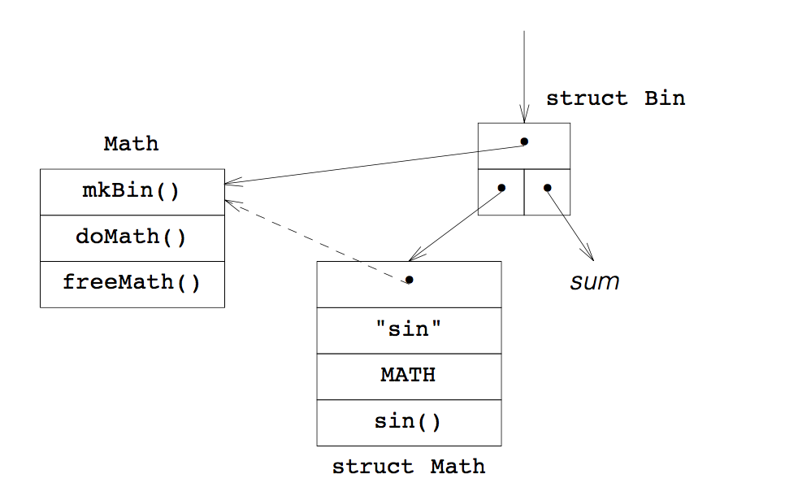

### <a name="5">5 编程的精明之处 符号表</a>

通过准确地控制结构体的长度来共用基本结构的功能，我们可以省去 `union` 笨重的用法。特别是和动态链接一起用的时候，我们有了一种统一且强健的方法来处理信息的分叉。有了基本机制，我们可以很容易地添加新扩展的结构，并且复用基本代码。

作为示例，我们将在[第 3 章](#3)里开始做的小计算器上添加关键字、常量、变量和数学函数。这些对象都存在一个变量表里，并使用同样的基本名称搜索机制。

##### <a name="5.1">5.1 扫描表示符</a>

我们在 [3.2部分](#3.2)里实现了 `scan()` 函数，它从主程序接收一行输入内容，每次调用都输出一个输入符号。要引入关键字、命名常量等，我们需要扩展 `scan()`。和处理浮点数字一样，我们提取字符串来进一步分析：

```
#define ALNUM "ABCDEFGHIJKLMNOPQRSTUVWXYZ" \ 
                            "abcdefghijklmnopqrstuvwxyz" \ 
                            "_" "0123456789"

static enum tokens scan (const char * buf)
{   static const char * bp;
    ...
    if (isdigit(* bp) || * bp == ’.’)
        ...
    else if (isalpha(* bp) || * bp == ’_’)
    {   char buf [BUFSIZ];
        int len = strspn(bp, ALNUM);
        
        if (len >= BUFSIZ)
            error("name too long: %—.10s...", bp);
        
        strncpy(buf, bp, len), buf[len] = ’\0’, bp += len;
        token = screen(buf);
    }
    ...
```

一旦有了一个标识符后，我们让一个新函数 `screen()` 来决定它的 `token` 值是什么。必要时，`screen()` 会在一个全局变量 `symbol` 里保存该符号的描述，解析器可以查看该描述。

##### <a name="5.2">5.2 使用变量</a>

一个变量有两种用法：它的值可以在表达式里被用作操作数，或者，表达式的结果可以被赋值给它。第一种情况是对 [3.5 部分](#3.5) 里的识别器的 `factor()` 的简单扩展：

```
static void * factor (void)
{   void * result;
    ...
    switch (token)
    {   case VAR:
            result = symbol;
            break;
        ...
```

`VAR` 是个唯一的值，`screen()` 在发现一个合适的标识符的时候把 `VAR` 存到 `token` 里。该标识符的其他信息会被存在全局变量 `symbol` 里。在这里，`symbol` 包含一个结点，该结点被用来表示变量是一个表达式树里的叶子结点。`screen()` 要么从符号表里找这个变量，要么用 `Var` 这个描述来创建。

识别赋值过程要更复杂一些。如果使用以下的语法的两种表达式的话，我们的计算器用起来会很顺手：

```
asgn : sum
     | VAR = asgn
```

然而，`VAR` 还能出现在 `sum` 的左侧，即，如何识别 C 风格的递归下降里出现的嵌套赋值会是个问题。\* 不管怎样，我们都要学习怎么处理关键字，所以我们接收了下面的语法：

\* 有个花招：仅在求和的时候试试。如果在返回的时候下一个输入的符号是 =，求和结果必须是个存变量叶子节点，我们才能赋值。 

```
stmt : sum
     | LET VAR = sum
```

这可以翻译为下面的函数：

```
static void * stmt (void)
{   void * result;
    switch (token) {
    case LET:
        if (scan(0) != VAR)
            error("bad assignment");
        result = symbol;
        if (scan(0) != '=')
            error("expecting =");
        scan(0);
        return new(Assign, result, sum());
    default:
        return sum();
    }
}
```

在主程序里我们将调用 `sum()` 改为调用 `stmt()`，我们的识别器已经准备好处理变量了。`Assign` 是用于结点的一种新的类型描述，它计算和并将其赋值给一个变量。

##### <a name="5.3">5.3 扫描器——Name</a>

下面是赋值的语法：

```
stmt : sum
     | LET VAR = sum
```

`LET` 是关键字的一个例子。在构建扫描器的时候我们还可以决定用什么来代表 `LET`：`scan()` 从输入行里提取一个标识符并传给 `screen()`，`screen()` 从符号表里查找并返回符合 `token` 的值，至少对于变量，会返回一个存在 `symbol` 里的结点。

识别器会丢弃 `LET`，但它会把变量存储为树的一个叶子结点。对于其它符号，比如数学函数的名称，不管扫描器返回什么符号，我们都大致想要使用 `new()`，以便获得一个新结点。因此，大部分情况下，我们的符号表里的条目应该与我们的树节点一样拥有动态链接功能。

对于关键字，一个 `Name` 结构需要包括输入的字符串和 token 值。我们后面会继承 `Name`，所有我们把这个结构定义在了表示文件 *Name.r* 里：

```
struct Name {               /* base structure */
    const void * type;      /* for dynamic linkage */
    const char * name;      /* may be malloc—ed */
    int token;
};
```

我们的符号永远不会消失：不管它们的名字是用于预定义的关键字的字符串常量，还是用于动态存储用户定义的变量的字符串，我们都不会回收它们。

在找一个符号之前，我们要先要把它放到符号表里。这不能通过调用 `new(Name, ...)` 来做，因为我们想支持比 `Name` 更复杂的符号，并且我们应该对它们隐藏符号表的实现。于是，我们提供了一个 `install()` 函数，它接收一个 `Name` 对象并将其插入符号表。下面是符号表的接口文件 *Name.h*：

```
extern void * symbol;           /* —> last Name found by screen() */

void install (const void * symbol);
int screen (const char * name);
```

识别器把像 `LET` 这样的关键字插入符号表之后，它们才能被扫描器找到。可以把这些关键关键字定义在一个结构体的常量表里——这对 `install()` 来说没什么不同。下面是用于初始化识别的函数：

```
#include "Name.h" 
#include "Name.r"

static void initNames (void)
{   static const struct Name names [] = {
        { 0, "let", LET },
          0 };
    const struct Name * np;
    for (np = names; np —> name; ++ np)
        install(np);
}
```

注意，关键字的表 `names[]` 不需要排序。我们使用了 *Name* 的表示文件来定义 `names[]`，也就是说，我们导入了 *Name.r*。由于关键字 `LET` 被废弃了，我们没有提供动态链接的方法。

##### <a name="5.4">5.4 超类实现——Name</a>

按名称搜索符号是个一般性的问题。但 ANSI 标准没有为此定义一个合适的库函数。`bsearch()`——二分法搜索有序的表——比较接近，但如果我们插入一个新的符号，我们需要调用 `qsort()` 设置进一步搜索的阶段。

UNIX 系统提供了两三个函数族来处理增长的表。`lsearch()`——先行搜索并在尾部添加(!)——不是完全有效。`hsearch()`——一个存结构体的哈希表，结构体由文本和一个信息指针组成——只维护了一个大小固定的表，还对条目造成了奇怪的结构。`tsearch()`——一个二叉树支持任意比较和删除——是最通用的一族，但若是初始的符号来自一个有序的序列，它会很低效。

在 UNIX 系统上，`tsearch` 可能是最好的这种方案了。可以在 [Sch87] 找到一个线索二叉树的可移植版本的源码。不过，要是这一族用不了，或者我们不能保证随机初始化，我们应该寻求一种更简单的实现方式。事实上，对于一个良好的 `bsearch()` 实现方案，我们可以很容易地通过扩展它来支持在有序数组里做插入操作：

```
void * binary (const void * key,
    void * _base, size_t * nelp, size_t width,
    int (* cmp) (const void * key, const void * elt))
{   size_t nel = * nelp;
#define base (* (char **) & _base)
    char * lim = base + nel * width, * high;

    if (nel  > 0) 
    {   for (high = lim - width; base <= high; nel >>= 1)
        {   char * mid = base + (nel >> 1) * width;
            int c = cmp(key, mid);
            
            if (c < 0)
                high = mid — width;
            else if (c > 0)
                base = mid + width, -- nel;
            else
                return (void *) mid;
        }
```

到这里为止，这是搜索任意数组的标准二分法。`key` 指向要找的对象，`base` 在最开始是一个存储 `*nelp` 的表的起始地址，每个元素都占 `width` 个字节，`cmp` 是比较 `key` 和表里元素的函数。在这里我们要么找到并返回一个表里的元素，要么 `base` 是 `key` 应该在表里的地址。我们按下面继续：

```
        memmove(base + width, base, lim — base);
    }
    ++ *nelp;
    return memcpy(base, key, width);
#undef base
}
```

`memmove()` 把数组的末尾移出数组 \*，然后 `memcpy` 插入 `key`。我们假设在数组尽头之外还有空间，并通过 `nelp` 表示添加了一个元素——`binary() ` 和标准函数 `binary() ` 不同，不同之处仅在于它使用的是包含表内元素个数的变量的地址而不是该变量的值。

\* 即使源地址和目标地址的区域有重合部分，`memmove ()` 也会拷贝字节；`memcpy()` 不会这么做，但它更高效。

有了通用的搜索和记录方法，我们可以很方便地管理符号表。我们首先要将一个 key 和表里的一个元素比较：

```
static int cmp (const void * _key, const void * _elt)
{   const char * const * key = _key;
    const struct Name * const * elt = _elt;

    return strcmp(* key, (* elt) —> name);
}
```

通过 key，我们只传递指向输入符号的文本的指针地址。表里的元素则都是 **Name** 结构体，我们只使用它们的 `.name` 部分。

调用 `binary()` 时通过使用合适的参数，我们能够实现搜索和定位操作。由于我们事先不知道符号的数量，我们要确保始终有空间让表扩张：

```
static struct Name ** search  (const char ** name)
{   static const struct Name ** names;    /* dynamic table */
    static size_t used, max;
    
    if (used >= max)
    {   names = names
            ? realloc(names, (max *= 2) * sizeof * names)
            : malloc((max = NAMES) * sizeof * names);
        assert(names);
    }
    return binary(name, names, & used, sizeof * names, cmp);
}
```

**NAMES** 是一个预先定义的常量，它指定了表的初始大小；每当空间用尽时，我们将表的大小扩大一倍。

`search()` 接收指向待搜索的文本的指针地址，返回表的入口的地址。要是在表里找不到该文本，`binary()` 会把 key——即，该文本的指针，而不是一个 Name 结构体——插到表里。这种策略是考虑到 `screen()` 的方便，当它在输入内容中识别到一个未知的标识符时会构造一个新的元素。

```
int screen (const char * name)
{   struct Name ** pp = search(& name);

    if (* pp == (void *) name)      /* entered name */ 
        * pp = new(Var, name);
    symbol = * pp;
    return (* pp) —> token;
}
```

`screen()` 让 `search()` 查找要被映射的输入符号。如果指向符号的文本的指针被加入到了符号表里，我们需要用一个描述新表示符的入口替换它。

对 `screen()` 来说，新标识符必须是一个变量。我们假设有一个类型描述 Var， 它知道如何构建描述了变量的 Name 结构。剩下的事情我我们交给 `new()`。不管怎样，我们用 `symbol` 指向符号表的入口，然后它的 `.token` 值。

```
void install (const void * np)
{   const char * name = ((struct Name *) np) —> name;
    struct Name ** pp = search(& name);

    if (* pp != (void *) name)
        error("cannot install name twice: %s", name);
    * pp = (struct Name *) np;
}
```

`install()` 简单一些。我们接收一个 `Name` 对象，然后用 `search()` 在符号表里找到它。`install()` 只负责处理新符号，所以我们应该总是能够在它的名字的位置插入对象。要不然，如果 `search()` 真的找到一个符号的话就麻烦了。
##### <a name="5.5">5.5 子类实现 — Var</a>

`screen()` 通过调用 `new()` 创建一个新的变量符号，并把它返回给识别器，识别器把它加到表达式树里。因此，`Var ` 创建的符号表元素要有和节点一样的能力。也就是说，当定义 `strcut Var ` 时，我们需要拓展 `struct Name` 从而能够被存入符号表里，我们还要支持用于表达式节点的动态链接函数。我们在 *Var.h* 中定义接口：

```
const void * Var;
const void * Assign;
```

一个变量由名字和值组成。当我们计算一个算数表达式的值的时候，我们返回 `.value` 部分。如果要删除一个表达式，我们不能删掉变量节点，因为它存在于符号表里。

```
struct Var {    struct Name _; double value; };

#define value(tree) (((struct Var *) tree) —> value)

static double doVar (const void * tree) 
{
    return value(tree);
}
static void freeVar (void * tree)
{
}
```

按照 [4.6](#4.6) 讲的，我们通过提供一个值的访问函数来简化代码。

创建变量的时候，要分配一个 `struct Var`，还要动态复制一份变量名称和识别器限定的 token 值 `VAR`：

```
static void * mkVar (va_list ap)
{   struct Var * node = calloc(1, sizeof(struct Var));
    const char * name = va_arg(ap, const char *);
    size_t len = strlen(name);
    
    assert(node);
    node —> _.name = malloc(len+1);
    assert(node —> _.name);
    strcpy((void *) node —> _.name, name);
    node —> _.token = VAR;
    return node;
}

static struct Type _Var = { mkVar, doVar, freeVar };

const void * Var = & _Var;
```

在符号被返回给 `screen()` 或者其他调用者之前，`new()` 负责把类型描述 `Var` 插入到节点里。

从技术角度来说，`mkVar()` 是 `Name` 的构造器。但是，只有变量名称需要动态存储。因为我们决定了在我们的计算器中，构造函数负责创建对象，我们不能让 `Var` 的构造函数调用 `Name` 的构造函数来维护 `.name` 和 `.token` 部分——`Name` 构造函数创建的是 `struct Name` 而不是 `struct Var`。

##### <a name="5.6">5.6 赋值</a>

赋值是一个二元运算。识别器确保我们有一个变量作为左操作数和一个求和方法作为右操作数。因此，我们真正要实现的是赋值操作，即被动态链接到类型描述的 `.exec` 部分的函数。

```
#include "value.h"
#include "value.r"

static double doAssign (const void * tree)
{
    return value(left(tree)) = exec(right(tree));
}

static struct Type _Assign = { mkBin, doAssign, freeBin };

const void * Assign = & _Assign;
```

我们共用了 `Bin` 的构造函数和析构函数，因此在实现算数运算的过程中 `Bin` 要被声明为全局可见。我们还共用了 `struct Bin` 和访问函数 `left()` 和 `right()`。这些都被导出在接口文件 *value.h* 和表示文件 *value.r*。`struct Var` 的访问函数 `value()` 有意允许修改，以便于赋值好实现。

##### <a name="5.7">5.7 Another Subclass — Constants</a>

没人想敲 π 或者其他数学变量的值。我们从 Kernighan 和 Pike’s hoc [K&P84] 那里找到些思路，为我们的计算器预定义一些常量。下面的函数需要在识别器的初始化过程中调用：

```
void initConst (void)
{   static const struct Var constants [] = {    /* like hoc */
        { &_Var, "PI", CONST, 3.14159265358979323846 },
        ...
        0 };

    const struct Var * vp;
    
    for (vp = constants; vp -> _.name; ++ vp)
        install(vp);
}
```


变量和常量几乎一样：它们都有名字和值，也都在符号表里；在算数表达式里都返回它们的值供使用；在删除算数表达式时都不应该被删除。但是，我们不能给常量复制，所以我们需要添加一个新的 token `CONST`，识别器在 `factor()` 中接收它，就像接收 `VAR` 一样，但它不能出现在 `stmt()` 中的赋值过程的左边。

##### <a name="5.8">5.8 数学函数 — Math</a>

ANSI-C 定义了很多数学韩式，比如 `sin()`、`sqrt()`、`exp()` 等等。作为另一个实现的练习，我们将要给我们的计算器添加一些拥有一个 double 类型参数和一个 double 类型结果的函数。
 
这些函数和一元操作符很像。我们可以给每个函数定义一种新的节点类型，然后集成 `Minus ` 和 `Name` 类的功能，不过还有一种简单的方法。我们可以把 `struct Name` 扩展为 `struct Math`：

```
struct Math {
    struct Name _;
    double (* funct) (double);
};

#define funct(tree) (((struct Math *) left(tree)) —> funct)
```

除了在输入里使用到的函数名称和供识别用的 token，我们在符号表的元素里存了像 `sin()` 这样的库函数的地址。

在初始化的过程中，我们调用下面的函数来把所有的函数描述输入到符号表里：

```
#include <math.h>

void initMath (void)
{   static const struct Math functions [] = {
        { &_Math, "sqrt", MATH, sqrt }, 
        ...
         0 };

    const struct Math * mp;
    
    for (mp = functions; mp —> _.name; ++ mp)
        install(mp);
}
```

一次函数调用就是一个 factor，就像使用一个减号一样。为了能够识别，我们需要扩展 factor 的语法：

```
factor : NUMBER 
       | — factor
       | ...
       | MATH ( sum )
```

`MATH ` 是 `initMath()` 输入的所有函数的通用 token。这转化成了以下对识别器里的 `factor()` 的更新内容：

```
static void * factor (void)
{   void * result;
    ...
    switch (token) {
    case MATH:
    {   const struct Name * fp = symbol;
        
        if (scan(0) != '(')
            error("expecting (");
        scan(0);
        result = new(Math, fp, sum());
        if (token != ')')
            error("expecting )");
        break;
    }
```

symbol first contains the symbol table element for a function like sin(). We save the pointer and build the expression tree for the function argument by calling sum(). Then we use Math, the type description for the function, and let new() build the following node for the expression tree:



We let the left side of a binary node point to the symbol table element for the func- tion and we attach the argument tree at the right. The binary node has Math as a type description, i.e., the methods doMath() and freeMath() will be called to exe- cute and delete the node, respectively.

The Math node is still constructed with mkBin() because this function does not care what pointers it enters as descendants. freeMath(), however, may only delete the right subtree:

```
static void freeMath (void * tree)
{
    delete(right(tree));
    free(tree);
}
```

If we look carefully at the picture, we can see that execution of a Math node is very easy. doMath() needs to call whatever function is stored in the symbol table element accessible as the left descendant of the binary node from which it is called:

```
#include <errno.h>
static double doMath (const void * tree)
{   double result = exec(right(tree));

    errno = 0;
    result = funct(tree)(result);
    if (errno)
    error("error in %s: %s",
        ((struct Math *) left(tree)) —> _.name,
        strerror(errno));
    return result;
}
```

The only problem is to catch numerical errors by monitoring the errno variable declared in the ANSI-C header file errno.h. This completes the implementation of mathematical functions for the calculator.

##### <a name="5.9">5.9 Summary</a>

Based on a function binary() for searching and inserting into a sorted array, we have implemented a symbol table containing structures with a name and a token value. Inheritance permitted us to insert other structures into the table without changing the functions for search and insertion. The elegance of this approach becomes apparent once we consider a conventional definition of a symbol table ele- ment for our purposes:

```
struct {
    const char * name;
    int token;
    union {             /* based on token */
        double value;
        double (* funct) (double); 
    } u;
};
```

For keywords, the union is unnecessary. User defined functions would require a much more elaborate description, and referencing parts of the union is cumber- some.

Inheritance permits us to apply the symbol table functionality to new entries without changing existing code at all. Dynamic linkage helps in many ways to keep the implementation simple: symbol table elements for constants, variables, and functions can be linked into the expression tree without fear that we delete them inadvertently; an execution function concerns itself only with its own arrangement of nodes.

##### <a name="5.10">5.10 Exercises</a>  

New keywords are necessary to implement things like while or repeat loops, if statements, etc. Recognition is handled in stmt(), but this is, for the most part, only a problem of compiler construction, not of inheritance. Once we have decided on the type of statement, we will build node types like While, Repeat, or IfElse, and the keywords in the symbol table need not know of their existence.

A bit more interesting are functions with two arguments like atan2() in the mathematical library of ANSI-C. From the point of view of the symbol table, the functions are handled just like simple functions, but for the expression tree we need to invent a new node type with three descendants.

User defined functions pose a really interesting problem. This is not too hard if we represent a single parameter by $ and use a node type Parm to point back to the function entry in the symbol table where we can temporarily store the argument value as long as we do not permit recursion. Functions with parameter names and several parameters are more difficult, of course. However, this is a good exercise to investigate the benefits of inheritance and dynamic linkage. We shall return to this problem in chapter 11.