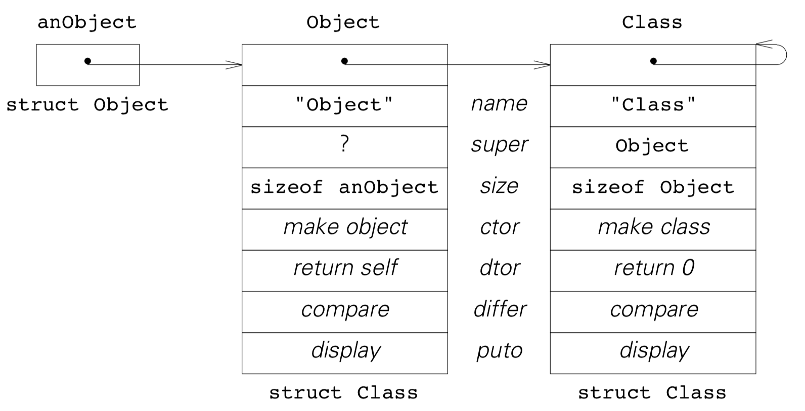

### <a name="6">6 类的层次结构 可维护性</a>

##### <a name="6.1">6.1 需求</a>

通过继承，我们可以把通用的数据类型演变成更有针对性的类型，也让我们免于重新编写基本功能。动态链接技术让我们弥补了通用数据类型可能有的不足。我们缺少的是一种全局组织方式来简化维护一大堆类的工作：

（1） 所有的动态链接必须指向正确的方法——比如，构造器不能被放到类描述的错误位置；<br>
（2）我们需要一个一致的方式来增加、移除或改变父类动态链接方法的顺序，且能够保证子类继承的正确性；<br>
（3）不能有漏洞，比如遗漏动态链接或者出现未定义方法；<br>
（4）如果我们继承了一个动态链接的方法，父类里的实现必须能够保持不被修改，也就是说，只用二进制信息的情况下也要能够实现继承；<br>
（5）不同的类族要能够拥有不同动态链接的方法——比如，只有[第4章](#4)里的`Point`和`Circle`能够用`draw()`方法，[第1章](#1)里的几个集合或者[第3章](#3)和[第5章](#5)里的表达式结点就不能用。

从这几点看来，使用动态链接会很难并且容易出错——如果我们不能改善这种情形，我们将只是做了一堆无用功。

我们前面用动态链接方法实现了一个列表，不管这么做对一个具体的类来说是否合理。这个列表被定义为`struct Class` ，在用到动态链接的地方都引用了它。感谢函数原型，ANSI-C 会确保函数名字（比如`Point_ctor`）和类描述里的对应的位置匹配，在类描述里它们被用于静态初始化。只有在有几个方法使用了兼容的接口或者我们做了粗心地重新编译的情况下，上面的第 1 条才会是个问题。

对于第 2 条，修改`struct Class`听起来像是个噩梦——我们需要打开每个类的实现去更新类描述的静态初始化过程，并且我们很容易在一些类里添加新的方法，从而也导致了问题 3。

在[5.6](#5.6)里我们用了一种优雅的方式让计算器支持了赋值操作：我们修改了源代码把[5.6](#5.6)里的用于二元结点的动态链接方法改成了公有，从而是我们能够复用它为`Assign`描述里的初始化方法，但是这很明显违反了第 4 条要求。

要是维护只是维护一个`struct Class`就已经有挑战性了，那要满足第 5 条我们就只能用不能版本的`struct Class`来满足不同的类族了。需求是非常合理的，但是：每个类都要有构造函数和析构函数；点、圆和其他图形对象要有绘制相关的方法；原子类型和字符串需要支持比较；像 Set、Bag 或 List 要有添加、查找和移除对象的方法；如此等等。

###### <a name="6.2">6.2 元类</a>

第 5 条需求并没有让事情变得更复杂，它实际上是指明了解决问题的方法。就像圆是在点上面添加了一些信息一样，圆和点的类的描述也都是在它们这两个类的类描述上添加了一个多态的`draw()`方法。

换句话说：只要两个类有同样的动态链接的方法，就算方法的实现不一样，它们也能用同一个`struct Class`来存储链接——`Point`和`Circle`就是这种情况。在添加新的动态链接方法之后，我们需要加长`struct Class`来容纳新的链接——通过这么做我们在一个只有构造函数和析构函数的类里给`Point`这样的类添加了`.draw`部分。

加长结构是我们说的继承，也就是说，我们有多个类描述拥有来自一个类的相同的一组方法，并且在类描述的类之间有继承关系。

我们把类描述的类称作*元类*。元类和普通的类的行为一样：`Point`和`Circle`，也就是所有点和所有圆的描述，是元类`PointClass`的两个对象，因为他们两个都能描述如何绘制。元类有方法：我们可以得到像`Point`或`Circle`这样的对象的大小，我们也可以通过 `Circle`对象检查`Point`是否确实描述了圆的父类。

由不同的类创建的对象可以用动态链接方法做不同的事情。元类是否需要动态链接方法呢？`delete(Point)`或`delete(Circle)`被调用的时候，也就是在我们想删掉点或圆的类描述时，也会调用`PointClass`里的析构函数。而删掉一个类的描述显然是不应该的，所以这个析构函数应该返回一个空指针。元类的构造函数则有用的多：

```
Circle = new(PointClass,      /* ask the metaclass */
"Circle",                               /* to make a class description */
Point,                                    /* with this superclass, */
sizeof(struct Circle),             /* this size for the objects, */
ctor, Circle_ctor,                   /* this constructor, */
draw, Circle_draw,               /* and this drawing method. */
0);                                         /* end of list */
```

这次函数调用的产生一个类描述，这个类的对象可以被构造、销毁和绘制。由于绘制是`PointClass`下所有的类描述的共有机制，所以`PointClass`的构造函数有必要知道如何在新的类描述里存放一个绘制方法的链接。

还有其他一些细节：当我们将父类的描述`Point`传递给`PointClass`的构造函数时，应该首先将`Point`里被继承的链接拷贝到`Circle`里，然后覆盖`Circle`里重写的方法。这样就彻底解决了双重继承的问题：我们在创建`Circle`时只指定圆特有的新方法；因为`PointClass`的构造函数会拷贝点的方法的地址，所以点所用的方法会默认被继承下来。

###### <a name="6.3">6.3 根——Object 和 Class</a>

拥有相同方法的类描述都是一个元类的对象。元类也是类，所以也有类描述。我们必须假设元类的类描述有时元（元元？）类的对象，反过来又是……

这样想下去就没有止境了。接下来我们先从能想到的最普通的对象着手。我们定义了一个类`Object`，它可以创建、销毁、比较和显示对象。

接口文件 *Object.h*：

```
extern const void * Object; /* new(Object); */

void * new (const void * class, ...);
void delete (void * self);

int differ (const void * self, const void * b);
int puto (const void * self, FILE * fp);
```

表示文件 *Object.r*：

```
struct Object {
    const struct Class * class; /* object’s description */
};
```

接下来我们定义对象的类描述的表示方法，即`struct Object`里的`.class`部分的结构。由于两个结构都会在同样的地方被用到，所以我们将它加到了*Object.h*里：

```
extern const void * Class; /* new(Class, "name", super, size sel, meth, ... 0); */
```

也加到了*Object.r*里：

```
struct Class {
    const struct Object _; /* class’ description */
    const char * name;  /* class’ name */
    const struct Class * super; /* class’ super class */
    size_t size; /* class’ object’s size */
    void * (* ctor) (void * self, va_list * app);
    void * (* dtor) (void * self);
    int (* differ) (const void * self, const void * b);
    int (* puto) (const void * self, FILE * fp);
}
```

`struct Class`是第一个元类`Class`每一个元素的表示。这个元类也是个类，所以它的元素也指向一个类描述。`Object`可以指向一个类描述，所以`struct Class`继承`struct Object`，即`Class`是`Object`的一个子类。

这没什么问题：对象是`Object`类的实例，它可以被创建、销毁、比较和显示。我们前面创建了一个类描述，并实现了一个不销毁类描述的析构函数。要是能够比较和显示类描述的话就更有用了。这也意味着元类`Class`和`Object`类有同样的方法和同样的描述，也就是从对象到他们的类描述，再到类描述的描述的这个关系链。初始化后，就有了下面的图：



问号所在的位置提出了一个两可问题：`Object`有没有父类？这本质上没什么区别，不过为了一致性我们把`Object`作为自己的父类，所以问号的位置应该是一个指向`Object`自己的指针。

###### <a name="6.4">6.4 子类—Any</a>

有了`Class`和`Object`的描述，我们就可以创建新对象甚至新的子类了。比如，一个子类`Any`，它所有的对象和任何其他对象都相等，也就是说`Any`重写了`differ()`让它始终返回 0 。下面是`Any`的实现和一个快速的测试方法，都在一个 *any.c* 文件里：

```
#include "Object.h"

static int Any_differ (const void * _self, const void * b)
{
    return 0;  /* Any equals anything... */
}
```

```
int main ()
{   void * o = new(Object);
    const void * Any = new(Class, "Any", Object, sizeOf(o), differ, Any_differ, 0);

    void * a = new(Any);
    puto(Any, stdout);
    puto(o, stdout);
    puto(a, stdout);
    
    if (differ(o, o) == differ(a, a))
        puts("ok");
    if (differ(o, a) != differ(a, o))
        puts("not commutative");
    
    delete(o), delete(a);
    
    delete(Any);
    
    return 0;
}
```

在实现新的类的时候我们需要引入它的父类的接口。`Any`和`Object`有相同的表示方式，由于这个类很简单我们都不需要引入父类的表示文件。通过元类`Class`创建一个新的实例，再用新的类名、父类描述和新类的对象的大小，我们就得到了`Any`这个类描述。

```
const void * Any = new(Class, "Any", Object, sizeOf(o), differ, Any_differ, 0);
```

并且，我们还指定了在新类里需要重写的动态链接方法。方法名字的顺序没关系，每个前面都有选择器的名字。0 表示结束。

这个程序产生了一个`Object`的实例和一个`Any`的实例，然后打印了新类的描述和两个实例。每个实例和自己都相等，所以程序输出 ok。`Any`重写了`differ()`方法，所以把 o 和 a 比较和用相反的顺序比较的结果不同：

```
$ any
Class at 0x101fc
Object at 0x101f4
Any at 0x10220
ok
not commutative
Any: cannot destroy class
```

很明显，我们不应该删除类描述。这个错误在编译时就已经确定了。

###### <a name="6.5">6.5 实现—Object</a>

实现`Object`类的思路很明确：构造函数和析构函数返回`self`，`differ()`检查两个参数指针是否相等。定义这些实现细节非常重要。不过，我们用了一个类的树形结构，把`Object`作为其他类的最顶级的父类；如果一个类不重写一个方法，比如`differ()`，那它就从`Object`继承，也就是说，对于`Object`里已经实现的所有动态链接方法，每个类至少都会有一个默认的实现。

这是一个通用的安全原则：每引入一个新的动态链接方法，我们就立即在最顶级的类里实现。这样就不会出现使用一个未定义的方法的情况。这里有一点需要讲一下，就是`Object`的`puto()`方法：

```
static int Object_puto (const void * _self, FILE * fp)
{   const struct Class * class = classOf(_self);

    return fprintf(fp, "%s at %p\n", class —> name, _self);
}
```

每个对象都指向一个类描述，并且我们已经在描述里存了类的名字。因此，对与每个对象我们至少都可以显示类名和对象的地址。在 [6.4](#6.4) 的测试程序的输出结果里，前三行内容说明我们还没有重写`Class`和`Any`里的这个方法。

`puto()`引用了`classOf()`函数，这个函数做了些安全性检查然后返回对象的类描述。

```
const void * classOf (const void * _self) 
{   const struct Object * self = _self;
    
    assert(self && self —> class);
    return self —> class;
}
```

同样地，我们可以通过对象获得它的大小。（*这个拼写比较容易出错，不过我还是用了。给方法起个好名字真的是门艺术。）不要忘了，从技术角度看，在 ANSI-C 里一个对象就是一个普通的`void *`：

```
size_t sizeOf (const void * _self)
{   const struct Class * class = classOf(_self);

    return class —> size;
}
```

有件事有待讨论：是应该通过对象获得它的大小，还是只应该通过对象获得它的类然后显示地通过类获得大小。如果我们为对象实现了`sizeOf()`方法，我们就不能把它用于类描述来获得对应对象的大小——我们只能得到类描述自己的大小。不过，在实际使用过程中，为对象实现`sizeOf()`更可取。相比之下，`super()`是一个静态链接方法，它返回了类的父类，而不是对象的父类。

###### <a name="6.6">6.6 实现—Class</a>

`Class`是`Object`的一个子类，所以我们可以直接继承用于比较和显示的方法。析构函数返回一个空指针，避免`delete()`真的把类描述的空间回收了。

```
static void * Class_dtor (void * _self) 
{   struct Class * self = _self;

    fprintf(stderr, "%s: cannot destroy class\n", self—>name);
    return 0;
}
```

下面是从一个类描述里获得其超类的访问函数：

```
const void * super (const void * _self) 
{   const struct Class * self = _self;
     assert(self && self —> super);
    
     return self —> super;
}
```

唯一的难点是如何实现`Class`的构造函数。因为这个函数会初始化一个新的类描述，继承也是在这里实现的，并且还要支持重写四个基本的方法。我们再来看看 [6.4](#6.4) 小节里是如何创建一个新的类描述的：

```
const void * Any = new(Class, "Any", Object, sizeOf(o), differ, Any_differ, 0);
```

这就是说`Class`构造函数接收了新的类描述的名字、父类和对象的大小。我们先从参数列表里获取这些内容：

```
static void * Class_ctor (void * _self, va_list * app)
{   struct Class * self = _self;
    
    self —> name = va_arg(* app, char *);
    self —> super = va_arg(* app, struct Class *);
    self —> size = va_arg(* app, size_t);
    
    assert(self —> super);
```

`self`不可能是空指针，否则我们也找不到这个方法。`super`可以是 0，不过这种情况并不可取。

接下来就是继承了。我们必须把在`super`处定义的父类描述里的构造函数和所有其他方法复制到`self`处的新的类描述里：

```
const size_t offset = offsetof(struct Class, ctor); ...
memcpy((char *) self + offset, (char *) self —> super 
                            + offset, sizeOf(self —> super) - offset);
```

有个前提，我们假设构造函数是`struct Class`里的第一个方法，然后用 ANSI-C 里的宏`offsetof()`来决定从哪里开始复制。幸运的是，`super`处定义的类描述是`Object`的子类并且继承了`sizeOf()`方法，所以我们计算要复制多少个字节。

虽然这个方案并不完美，但似乎是最好的折中方案了。当然，我们也可以把`super`处的整块空间复制过来，然后把新名字存进来，等等。 但我们还是要处理新的类描述里最前面的`struct Object`，因为`new()`已经在那里存了类描述的类描述。

`Class`的构造函数的最后一部分重写了在`new()`参数列表里指定的方法。ANSI-C 不支持将函数指针复制给`void *`，反过来也不支持，所以要做一些转换：

```
{
    typedef void (* voidf) (); /* generic function pointer */
    voidf selector;
    va_list ap = * app;

    while ((selector = va_arg(ap, voidf))) 
    {   voidf method = va_arg(ap, voidf);
        
        if (selector == (voidf) ctor)
            * (voidf *) & self —> ctor = method;
        else if (selector == (voidf) dtor)
            * (voidf *) & self —> dtor = method;
        else if (selector == (voidf) differ)
            * (voidf *) & self —> differ = method;
        else if (selector == (voidf) puto)
            * (voidf *) & self —> puto = method;
    }
    return self;
}}
```

正如我们将在 [6.10](#6.10) 里看到的，参数列表里的这一部分在所有类的构造函数里被很好的共用了，所以配对的选择器/方法可以用任何顺序传入。我们没有再通过增长`*app`来实现，而是将这个值的副本`ap`传给了`va_arg()`。

这么存方法有几个问题：要是类的构造函数没有对应的选择器，对应的选择器/方法就会被忽略，但至少它不会被加到不是它的类描述里。由于参数列表和我们的转换过程避开了类型检查，如果方法的类型不对，ANSI-C 编译器将检查不到错误。这里我们就要靠程序员将选择器和对应的方法匹配了，它们必须是按对指定而且是合理的。

###### <a name="6.7">6.7 初始化</a>

我们一般是通过在一个元类描述上调用`new()`来获得一个新的类描述。在`Class`和`Object`的例子中，我们可能会有下面的调用过程：

```
const void * Object = new(Class, 
        "Object", Object, sizeof(struct Object),
        ctor, Object_ctor,
        dtor, Object_dtor,
        differ, Object_differ,
        puto, Object_puto,
        0);
        
const void * Class = new(Class,
        "Class", Object, sizeof(struct Class),
        ctor, Class_ctor,
        dtor, Class_dtor,
        0);
```

然而，这里每个调用都要求另一个调用已经完成了。所以，*Objetct.c* 里的`Class`和`Object`的实现要通过静态初始化类描述。我们只有这一次是显示地初始化`struct Class`：

```
static const struct Class object [] = {
    {   { object + 1 },
        "Object", object, sizeof(struct Object),
        Object_ctor, Object_dtor, Object_differ, Object_puto
    },
    {   { object + 1 },
        "Class", object, sizeof(struct Class),
        Class_ctor, Class_dtor, Object_differ, Object_puto
    }
};

const void * Object = object;
const void * Class = object + 1;
```

数组的名字是数组里第一个元素的地址，它可以被用来初始化元素里的各个部分。我们把这个初始化过程完全括了起来，以免`struct Object在后面被修改了。

###### <a name="6.8">6.8 选择器</a>

选择器的作用和[第 2 章](#2)里的一样：参数`_self`是用于动态链接的对象。我们确保这个对象存在，也确保要的方法也存在。然后我们调用方法并把所有的参数传给它；所以，这个方法可以认为`_self`是正确的对象。最后，我们返回该方法的值结果值（如果有的话）做为选择器的结果。

每个动态链接的方法都要有一个选择器。截至目前，我们把构造函数和析构函数的调用过程隐藏在`new()`和`delete()`里，但在传给`Class`的构造函数的配对的选择器/方法里，我们还是需要函数名`ctor`和`dtor`。我们后面可能会决定动态绑定`new()`和`delete()`；所以在`ctor`和`dtor`的位置使用他们的名字并不是个好方式。

我们已经引入了一个所有类共有的父类`Object`，还给了它能够简化选择器函数实现过程的功能。`classOf()`作用于一个对象并返回一个指向它的类描述的非零指针。这就让下面`delete()`的实现成了可能：

```
void delete (void * _self) {
    if (_self)
        free(dtor(_self));
}

void * dtor (void * _self)
{   const struct Class * class = classOf(_self);
    
    assert(class —> dtor);
    return class —> dtor(_self);
}
```

`new()`必须得小心实现，不过实现方式类似：

```
void * new (const void * _class, ...)
{   const struct Class * class = _class;
    struct Object * object;
    va_list ap;
    
    assert(class && class —> size);
    object = calloc(1, class —> size);
    assert(object);
    object —> class = class;
    va_start(ap, _class);
    object = ctor(object, & ap);
    va_end(ap);
    return object;
}
```

我们验证了类描述，并确保可以创建一个默认被零填充的对象。接下来我们初始化了对象的类描述，然后就可以让选择器`ctor()`找到构造函数并执行：

```
void * ctor (void * _self, va_list * app)
{   const struct Class * class = classOf(_self);
    
    assert(class —> ctor);
    return class —> ctor(_self, app);
}
```

可能还会有很多其他要检查的地方，不过我们有了一个统一且健壮的接口。

###### <a name="6.9">6.9 父类选择器</a>

在子类的构造函数执行它自己的初始化过程之前，它要先调用父类的构造函数。相似地，子类的析构函数在回收完自己的资源之后要调用父类的析构函数。我们在实现选择器函数的时候，也要提供调用父类的选择器：

```
void * super_ctor (const void * _class, void * _self, va_list * app)
{   const struct Class * superclass = super(_class);

    assert(_self && superclass —> ctor);
    return superclass —> ctor(_self, app);
}

void * super_dtor (const void * _class, void * _self) 
{   const struct Class * superclass = super(_class);

    assert(_self && superclass —> dtor);
    return superclass —> dtor(_self);
}
```

这些选择器只应该被子类实现调用；所以，我们把它们的声明包含在表示文件里，而不是接口文件里。出于安全考虑，我们为所有动态链接的方法提供父类选择器，也就是说每个选择器都有一个对应的父类选择器。这样一来，每个动态链接方法都有一个简单方式来调用父类的方法。

实际上，有个貌似可行的微妙陷阱。想想任意一个类`X`的一个方法会怎样调用它的父类的方法。下面是正确的方式：

```
static void * X_method (void * _self, va_list * app) 
{   void * p = super_method(X, _self, app);
    ...
```

从上面父类选择器里我们看到这个例子中`super_method()` 调用了：

```
super(X) —> method(_self, app);
```

也就是定义了`X_method()`方法的类`X`的父类里的方法。就算是某个子类`Y`继承了`X_method()`，最后还是会调用到同一个方法，因为该方法的实现与任何的继承都是独立的。

下面`X_method()`的代码看起来好像更合理，但是一旦这个方法被继承后就有问题了：

```
static void * X_method (void * _self, va_list * app)
{   void*p= /*WRONG*/
            super_method(classOf(_self), _self, app);
    ...
```

现在父类选择器的定义是：

```
super(classOf(_self)) —> method(_self, app);
```

若`_self`的类是`X`，我们访问的方法就会和前面一样。不过，如果`_self`的类是`X`的子类`Y`，我们就得到：

```
super(Y) —> method(_self, app);
```

这就还是`X_method()`，也即是说调用的不是父类的方法，而是出现了递归调用。

###### <a name="6.10">6.10 一个新的元类——PointClass</a>

`Objejct`和`Class`在我们的类结构里处于最顶级。每个类都是`Object`的子对象，并且继承了它的方法。每个元类都是`Class`的子类并且使用它的构造函数。[6.4](#6.4) 里的`Any`说明要创建一个子类其实很简单，只需要替换掉父类里的动态链接方法，也可以定义新的静态方法。

现在我们来构造一些功能更丰富的类。作为例子，我们把`Point`和`Circle`与我们的类结构关联起来。这些类有一个新的动态链接方法`draw()`；所以我们需要一个新的元类来放这个链接。下面是接口文件*Point.h*：

```
#include "Object.h"

extern const void * Point; /* new(Point, x, y); */

void draw (const void * self);
void move (void * point, int dx, int dy);

extern const void * PointClass; /* adds draw */
```

子类总是要引入父类并定义一个指向类描述的指针，要是有元类的话还要有一个指向元类的指针。引入元类之后，我们就能在声明元类指针的接口文件里为该动态链接方法声明选择器。

表示文件`Point.r`里包括了对象结构`struct Point`和之前用于访问的宏定义，也包括了父类选择器和元类的结构：

```
#include "Object.r"

struct Point { const struct Object _; /* Point : Object */
        int x, y;   /* coordinates */
};

#define x(p)    (((const struct Point *)(p)) —> x)
#define y(p)    (((const struct Point *)(p)) —> y)

void super_draw (const void * class, const void * self);

struct PointClass {
    const struct Class _;   /* PointClass : Class */
    void (* draw) (const void * self);
};
```

实现文件`Point.c`里有`move()`、`Point_draw()`、`draw()`和`super_draw()`。这些方法和之前写法一样；我们在上个小节里看到了父类选择器的技术。构造函数必须调用父类的构造函数：

```
static void * Point_ctor (void * _self, va_list * app)
{   struct Point * self = super_ctor(Point, _self, app);
    
    self —> x = va_arg(* app, int);
    self —> y = va_arg(* app, int);
    return self;
}
```

这个文件里新加的一点是元类的构造函数。它调用了父类的构造函数来实现继承，然后和`Class_ctor()`一样用了同样的遍历方式来重写新的动态链接方法`draw()`。

```
static void * PointClass_ctor (void * _self, va_list * app)
{   struct PointClass * self = super_ctor(PointClass, _self, app);
    typedef void (* voidf) ();
    voidf selector;
    va_list ap = * app;
    
    while ((selector = va_arg(ap, voidf)))
    {   voidf method = va_arg(ap, voidf);
    
        if (selector == (voidf) draw)
            * (voidf *) & self —> draw = method;
    }
    
    return self;
}
```

注意，我们和父类的构造函数共用了参数列表里配对的选择器/方法：不管`Class_ctor()`返回的`* app`是什么，`ap`都会接收，然后开始遍历。

有了这个构造函数，我们可以动态初始化新的类描述：`PointClass`是用`Class`创建的，而`Point`又是用`PointClass`创建的。

```
void initPoint (void)
{
    if (! PointClass)
        PointClass = new(Class, "PointClass",
                            Class, sizeof(struct PointClass),
                            ctor, PointClass_ctor,
                            0);
    
    if (! Point)
        Point = new(PointClass, "Point",
                    Object, sizeof(struct Point),
                    ctor, Point_ctor,
                    draw, Point_draw,
                    0);
}
```

写实现过程的思路很清晰：我们指定类名、继承关系和对象结构的大小，然后我们为文件里定义的所有的动态链接方法添加了配对的选择器/方法。每个参数列表都是以 0 结束。

[第 9 章](#9)里我们会把这个初始化过程做成自动的。目前而言，`initPoint()`被添加到了*Point.h*里，这个函数一定要在创建点或者子类之前调用。这个函数内部是连锁的，它能够被多次调用——它只会为生成一个类描述`PointClass`和`Point`。

要是从`main()`里调用`initPoint()`的话，我们可以复用 [4.1](#4.1) 里的测试程序*points*并且得到同样的输出：

```
$ points p 
"." at 1,2 
"." at 11,22
```

`Circle`是在[第 4 章](#4)引入的`Point`的子类。把它添加到类结构里后，我们就可以把 [4.7]($4.7) 里构造函数里的笨拙代码删掉了。

```
static void * Circle_ctor (void * _self, va_list * app)
{   struct Circle * self = super_ctor(Circle, _self, app);
    
    self —> rad = va_arg(* app, int);    
    return self;
}
```

当然，我们还要添加一个初始化函数`initCircle()`，在`main()`里创建圆之前要调用它。

```
void initCircle (void)
{
    if (! Circle)
    {   initPoint();
    
        Circle = new(PointClass, "Circle",
            Point, sizeof(struct Circle),
            ctor, Circle_ctor,
            draw, Circle_draw,
            0);
    }
}
```

由于`Circle`依赖`Point`，在初始化`Circle`之前要调用`initPoint()`。这些函数只会把真正要做的事做一遍，只要我们注意函数内部的依赖关系，我们可以用任何顺序调用它们。

###### <a name="6.11">6.11 总结</a>

对象会指向它们的类描述，多数的类描述都包含有指向动态链接方法的指针。拥有一组同样方法的指针的类描述构成了一个元类——类描述也是对象。一个元类也有一个类描述。

由于我们是从一个简单的`Object`类和以`Object`作为父类的第一个元类`Class`出发，目前事情还很有限。如果同一批方法——构造函数、析构函数、用于比较的函数和用于显示的函数——可以被用于对象和类描述的话，描述了`Object`类的元类描述`Class`也可以描述自己。

一个元类的构造函数填入一个类描述，这就实现了双重继承，析构函数通过返回 0 来防止类描述被销毁，用于显示的函数则可以输出方法的指针，等等。两个类描述只有在地址相等时才算是同一个类描述。

要是我们想添加一个像`draw()`这样的动态链接方法，我们需要一个新的元类，因为只有构造函数才能把方法的地址加到类描述里。元类描述总会用到`struct Class`，并通过下面的调用过程被创建：

```
PointClass = new(Class, ...
                    ctor, PointClass_ctor,
                    0);
```

在有了元类描述之后，我们可以基于这个元类创建新的类描述并加入新方法：

```
Point = new(PointClass, ... 
            draw, Point_draw,
            ... 
            0);
```

在用这个新类创建对象之前，这两个调用过程必须被执行过一次。有一种写元类构造函数的标准方法，好让匹配好的选择器/方法能被以任何顺序传入。通过在元类描述上调用`new()`可以创建更多的类。

选择器也有标准的写法。要保证构造函数和析构函数总会调用父类的函数。为了简化编码工作，我们提供了和选择器有相同参数的父类选择器；第一个额外的参数必须是调用父类选择器的方法所在的类。父类选择器也有标准的写法。

风格一致验证方式会让实现更小更健壮：选择器验证对象、它的类和方法是否存在；父类选择器还要验证新的类参数；一个动态链接方法只会被选择器调用，也就是说它不必验证自己的对象。静态链接方法和选择器一样：它必须验证它的参数对象。

我们来回顾一下对象和类的两个基础组件的含义以及我们的命名习惯。每个类最后都是以`Object`最为父类。对于一个指向`Object`的一个任意子类的对象的指针 *p* 来说，`p->class`指向该对象的类描述。假设指针 *C* 指向同一个类描述并且 *C* 是定义在接口文件 *C.h* 里的类名，那么 *p* 指向的对象会被用`struct C`表示。这解释了为什么 [6.3](#6.3) 里的`Class->class`必须指向`Class`自己：`Class`指向的对象被`struct Class`表示。

每个类描述最前面必须有一个`struct Class`用来存类名或者父类描述的指针等内容。现在让 *C* 指向一个类描述，然后让`C->super`和定义在接口文件 *S.h* 里的指针 *S* 指向同一个类描述，也就是说 *S* 就是 *C* 的父类。在这个例子里，`struct C`结构的最前面必须是个`struct S`。这就解释了为什么 [6.3](#6.3) 里的`Class->super`必须指向`Object`：我们规定`struct Class`以一个`struct Object`开始。

这个规则的唯一例外是`Object->super`的值是`Object`。我们已经在 [6.3](#6.3) 说了这是一个两可的决定。