### <a name="7">7 ooc 预处理器 执行编码标准</a>

我们在上一章里解决了如何保持类的可维护性这个难题，但同时也引入了一个更大的问题：我们现在对于特定的函数的写法（尤其是一个元类的构造函数）以及函数的依赖关系（选择器、父类选择器和初始化方法）有非常多的规定。我们还为防御式编程（即参数检查）制定了规则，但这些规则并不统一：在选择器和静态链接方法上我们要非常严谨，而在动态链接方法上我们可以放松一些。要是我们在后面想修改规则，就要改大量的代码——这将是个机械且容易出错的过程。

我们将在本章看到预处理器 *ooc* 的设计方法，它能够帮我们遵守在上一章里制定的规则。预处理器很简单，只要几天的时间就能用 *awk*[AWK88] 实现，并且能让我们遵守（以及以后重新设计）我们制定的编码规则。在附录 C 里有 *ooc* 的操作手册，附录 B 里有它的详细实现过程，而作为本书资源的一部分，你还可以获取到它完整的源代码。

*ooc* 不是要引入一种新的编程语言——我们还是用 ANSI-C，并且 *ooc* 的输出内容和我们手写的没什么两样。

##### <a name="7.1">7.1 再探 Point</a>

我们要设计一个帮我们维护类和编码规范的预处理器 *ooc*。设计这样一个预处理器的最好的方法是拿一个已经有的具有代表性的类作为例子，来看看在对预处理器的能力做出合理评估的前提下，我们能如何减少花在实现上的精力。长话短说，我们先用预处理器“玩”一会儿。

[第 4 章](#4)和 [6.10](#6.10) 里的`Point`是个不错的例子：它不是我们系统的最顶级的类，它需要一个新的元类，并且它还有一些有代表性的方法。接下来我们将使用斜体字，用 *Point* 的方式引用它，表示它是用作我们的预处理器的处理对象。

我们从一个我们易懂而基于 *awk* 的预处理器易读的类描述开始，
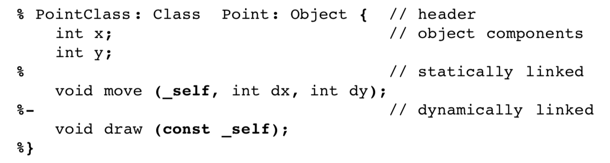
这个类描述里加粗的内容是指 *ooc* 可以识别这些内容；正常字体的内容是预处理器要读取并在其他地方重新生成的。注释以`//`开始并一直到行尾；多行内容可以用反斜线连接。

我们这里表示了一个新类 *Point*，它是 *Object* 的子类。对象有新组件 *x* 和 *y*，两个的类型都是 *int*。静态链接方法`move()`可以使用其他参数改变它的对象。我们还引入了一个新的动态链接方法`draw()`；所以，我们必须通过扩展元父类 *Class* 来获得一个新的元类 *PointClass*。`draw()`方法的对象参数是`const`，即它不能被修改。

要是没有新的动态链接方法的话，类的描述就更简单了。以`Circle`为例：

```
% PointClass Circle: Point {    // header
    int rad             // object component
%}                      // no static methods
```

这些简单而线性导向的描述包含了足够多的用于生成接口文件所需的信息。下面的模式展示了 *ooc* 是怎样生成 *Point.h* 的：
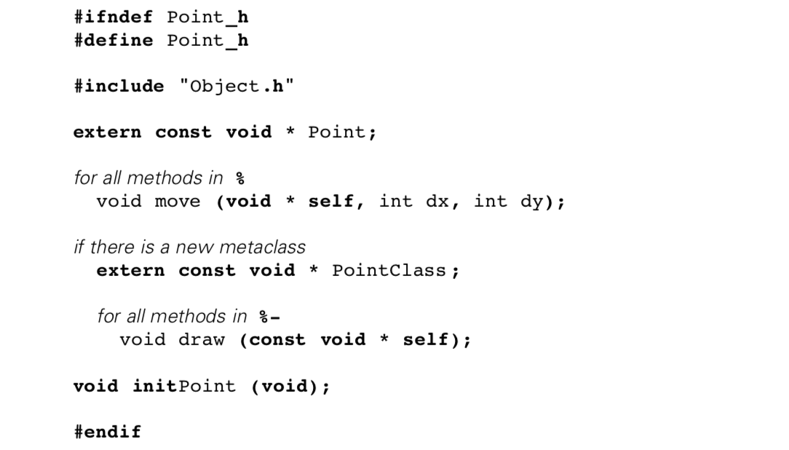
被黑体字标记的是适用于所有接口文件的部分。正常字体的内容是 *ooc* 要从类描述里读取然后插入到接口文件里的。参数列表被做了一些修改：`_self`或`const _self`被转换成了合适的指针；其他参数被直接复制了过来。

这个模式里的有些部分被重复使用了，比如特定链接方式的所有方法，或者一个方法的所有参数。该模式的其他部分依赖于一些条件，比如要先定义好一个新的元类。这些内容都被用斜体和缩进表示。

这个类描述也包含了足够多的用于生成表示文件的信息。下面是用于生成 *Point.r* 的模式：
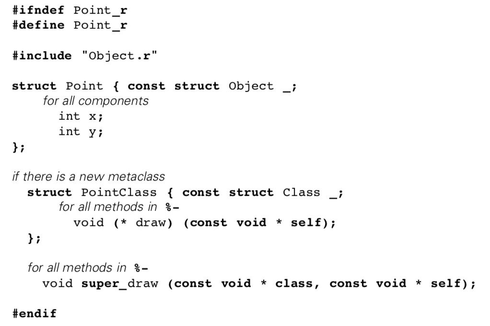
原始文件可以在 [6.10](#6.10) 找到。它包括用于访问的宏定义`x()`和`y()`。为了让 *ooc* 能够把它们添加到表示文件里，我们采用了一个惯例——一个类的描述文件除了该类的描述之外还可以包含额外的行。这些行会被复制到一个接口文件，或者要是它们前面的一行包括`%prot`的话，它们就会被复制到表示文件里。`prot`指的是受保护的信息——这些内容在一个类和它的子类的实现里可以访问到，但在调用该类的程序里访问不到。

类的描述包含了足够多的信息，*ooc* 也可以为实现文件生成很大一部分内容。作为例子，我们来看一下 *Point.c* 的各个部分：

```
#include "Point.h" // include
#include "Point.r"
```

首先，实现文件引入了接口和表示文件。
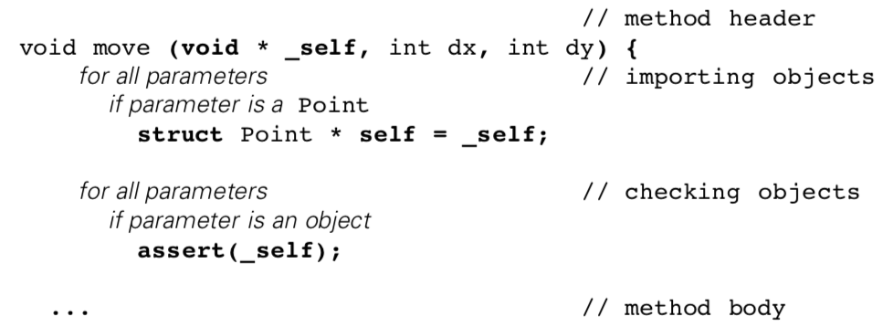
对于静态链接方法，我们在生成该方法的头部的时候会检查它们是否试用于该类。通过遍历参数，对于所有引用了该方法所在的类的对象的参数，我们可以为它们都初始化本地变量，并且能防止方法中出现空指针。
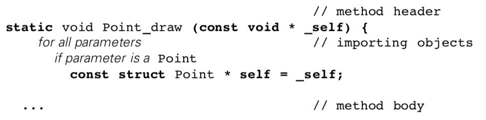
对于动态链接方法，我们也会做检查、生成方法头部并导入对象。考虑到选择器要验证过对象就是它们所表现出的样子，这个模式会有点不一样。

不过还有一些问题。作为 *Object* 的子类，我们的 *Point* 类有可能会把像`ctor`这种首先出现在 *Object* 里的动态链接方法重写。如果 *ooc* 要生成所有方法的头部，我们就要沿着类的结构向上读取所有父类的描述，一直到最顶级。根据 *Point* 的类描述里写的，父类是 *Object*，我们一定要能够找到父类的类描述文件。明显的方案是把 *Object* 的描述存到一个文件里，并叫一个类似 *Object***.d**相关的文件名。

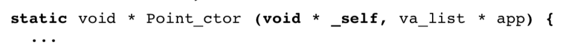
还有个问题是，`Point_ctor()` 调用了父类的选择函数，所以就不需要像`Point_draw ()`一样导入参数对象了。要是有方法能让我们每次都告诉 *ooc* 是否要导入和检查对象就好了。
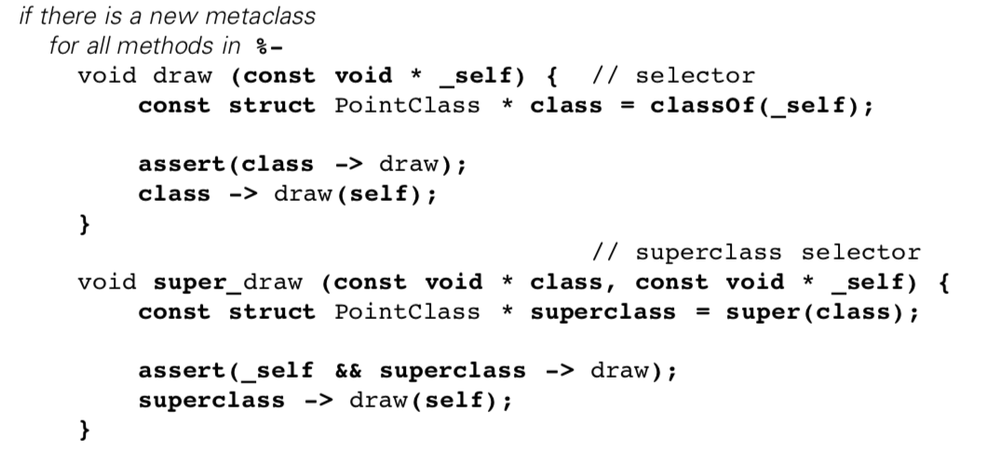
如果类描述定义了一个新的元类，我们就可以为所有新的动态链接方法生成选择器和父类选择器。如果我们想的话，在每个选择器里我们都可以遍历参数并检查对象类型的参数不存在空指针。
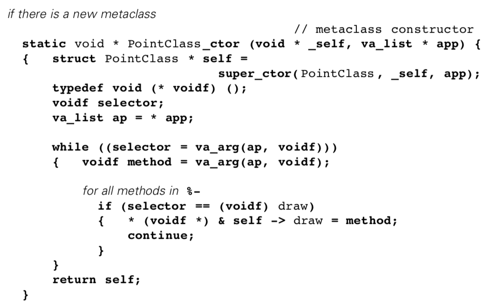
我们通过遍历类描述里的方法定义，我们可以生成元类构造函数。然而，我们必须得告诉 *ooc* 要为`ctor`使用合适的方法头部——不同的项目对构造函数的约定可能不一样。
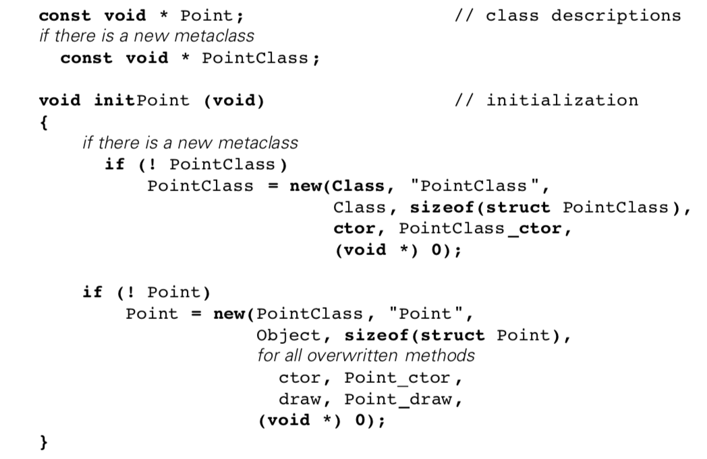
这个初始化函数依赖于遍历类的实现里的重写的所有动态链接方法。

##### <a name="7.2">7.2 设计</a>

现在我们先从 *Point* 的预处理过程里得出几个结论。我们从一个非常简单、线性导向的类描述开始：
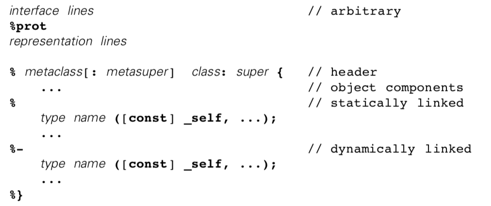
唯一的难点是我们要解析参数列表并从每个声明符号里把类型和名称拆开。一个简单的方法是要求如果有`const`的话，它要出现在类型前面，而类型要在名称前面。（* 如果必要的话，这总可以用`typedef`解决。）我们还识别了下面特殊的情形：

```
_self               message target in the current class
_name               other object in the current class
class @ name        object in other class
```

这些都可以被`const`修饰。当前类的对象在被导入的时候被取消引用了。

一个类的类描述的文件名是该类的名字后面加个**.d**，以便 *ooc* 能够找到父类的描述。对于元类我们不用过于担心：一个类要么和它的父类拥有同一个元类，要么它有一个新的元类，并且这个元类的父类是该类的父类的元类。不论是哪种情况，我们在读取父类的描述后，都能有足够信息来处理元类：

*ooc* 在读懂类的描述后，它就有足够的信息来生成接口文件和表示文件了。将命令设计为过滤器是个好方法，比如显示地要求重定向 i/o 来创建文件，然后就有了下面对预处理器的典型调用过程：

```
$ ooc Point -h > Point.h # interface file
$ ooc Point -r > Point.r # representation file
```

实现文件要难一些。*ooc* 要能够识别出方法体，并且要能知道是否需要检查或者导入参数。我们要是把方法体加到类描述文件里的话，我们虽然把所有内容放到了一起，但为此要做更多的处理工作：每次运行时 *ooc* 都需要把直到最顶级类的类描述文件加载进来，虽然只有最外层的类描述文件对方法体有用。除此之外，实现要比接口更容易变动；如果把方法体和类描述放在一起的话，我们每次修改一个方法体时，*make* 都会重新生成接口文件，这很可能会引起许多不必要的重新编译。（* *yaac* 在头文件 *y.tab.h* 上有一个相似的问题。标准的处理方式是复制这个文件，只有当它是新的时修改复制的文件，然后在 *makefile* 的规则里使用复制的文件。请参考 [K&P84]）

一个简单的方案是让 *ooc* 在读取类描述文件后生成一个包含实现过程的框架的实现文件，它包含一个类所有可能的方法头部和新的选择器（如果有的话），以及用于初始化的代码。这样做的话需要向上遍历它的父类来为遇到的所有动态链接方法生成头部和不完整的方法体。下面是 *ooc* 的调用方式：

```
$ ooc Point -dc > skeleton # starting an implementation
```

这为一个新的实现过程创造了不错的起点，不过它很难维护：这个实现框架会包含所有可能的方法。基本思路是删掉我们不需要的部分。但是，每个方法都会出现两次：一次是和头部与部分方法体一起出现，另一次是在生成类描述的时候出现在参数列表里。虽然很难，但绝对有必要保证这两点同步。

*ooc* 是被当做一个开发工具和维护工具的。当我们修改了类描述里的方法头部时，它应该能够将该修改应用到所有的实现文件里。要是使用前面的框架的方案的话，我们只能通过生成一个新的框架然后手动把内容修改回来——这显然不可行!

如果我们不想把方法体和类描述放在一起，并且需要 *ooc* 能够修改已有的实现文件的话，我们就是在把 *ooc* 当成一个预处理器来设计了。下面是典型的调用过程：

```
$ ooc Point Point.dc > Point.c # preprocessing
```

*ooc* 加载 *Point* 的类描述，然后读取实现文件 *Point.dc*，再把该文件预处理后的版本写到标准输出里。通过使用预处理指令，而不是不能修改的 C 文件，我们还可以把这个方法与前面描述的框架方案相结合。

##### <a name="7.3">7.3 预处理</a>

*ooc* 要提供哪些预处理指令呢？再看看 [7.1](#7.1) 里 *Point* 的例子，*ooc* 能在三个方面有用：给定一个方法名，它能知道方法头部；给定一个方法名，它能检查和导入参数对象；它还能生成需要的选择器、元类构造函数和初始化函数。我们还用 *Point* 做为例子，下面的实现文件 *Point.dc* 看起来挺合理：
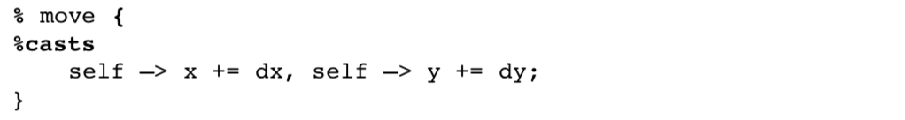
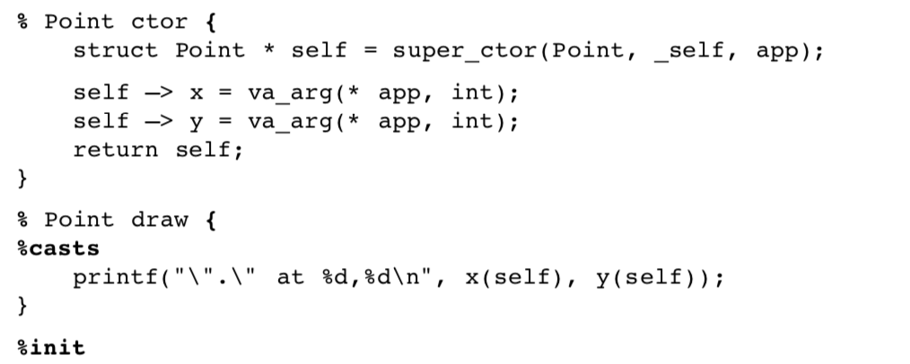
粗体内容是 *ooc* 感兴趣的地方：

```
% method {          header for statically linked method
% class method {    header to overwrite dynamically linked method
% casts             import object parameters
% init              create selectors and initialization code
```

对于一个静态链接方法，我们已经知道了它是在哪个类里声明的。但是，这个类是可以指定的，并且我们以后要是想修改方法的链接方式的话，我们不需要再去编辑源文件。

我们是不是不能要求程序员写方法头部、参数列表等内容呢？虽然这样做会让实现文件更易读，但若是方法的定义被修改了的话就会更难维护。它也会变得更难解析。

##### <a name="7.4">7.4 实现策略</a>

现在我们知道 *ooc* 要做的事了。那我们要怎么实现这个预处理器呢？考虑到效率的原因，我们最后可能要借助于像 *lex* 和 *yacc* 这样的平台，不过要是我们使用一个像 *awk* 或 *perl* 这样的字符串编程语言的话第一个实现会简单很多。要是这管用的话，我们就能够知道必要的算法和数据结构了，然后再把它们转到一种效率更高的实现方式上会很容易；我们甚至可能会用一个将 *awk* 转为 C 的翻译器来做这件事。总之，第一次实现选择用简单的方式能够让我们验证我们的思路是可行且方便的。

*ooc* 负责解析类描述并且构建一个数据库。有了这个数据库，命令行选项就能知道要生成什么内容。正如我们所看到的，这个生成过程可以基于某种模式来直接把单词打印出来或者用数据库中的信息替换某些单词。我们的模式里有遍历，所以一个模式实际上就像是一个 *awk* 函数加上控制结构和变量。

*ooc* 的第一个实现版本事实上是这工作的，但它很难修改。还有一种更好的方式：一种支持文本替换、循环和条件语句的简单报表语言，它被用来表示一种模式，*ooc* 会解读这种语言来生成结果。

附录 B 里有这个实现过程的详细内容。在附录 C 里这种报表语言被作为 *ooc* 的手册的一部分。这个报表语言大概支持二十五种替换、十种循环、两种条件判断，和一种在一个报表里调用另一个报表的方式。作为例子，下面是生成选择器的过程：

```
`{if `newmeta 1
    `{%-
        `result `method ( `{() `const `type `_ `name `}, ) { `n
`t          const struct `meta * class = classOf(self); `n
            `%casts
`t          assert(class -> `method ); `n
`t          `{ifnot `result void return `} \
                class -> `method ( `{() `name `}, ); `n
        } `n
    `}
`}
```

在报表里，*ooc* 寻找以反引号开头的内容；分组以 **\`{** 开始，以 **\`}** 结束，它要么是循环，要么是条件判断；报表调用以 **\`%** 开始；其他以反引号开始的单词都被数据库里的内容替换。

**\`{** 接收接下来的两个单词，如果两个单词相等的话就会执行该分组剩下的内容。当 *ooc* 在处理一个定义了一个新的元类的类描述时，**\`newmeta** 会被替换为 **1**。所以，选择器只会为新的元类生成。

**\`{%-** 是一个对类描述里所有动态链接方法的遍历。**\`method** 会被当前的方法名称替换；**\`result** 是当前的返回类型。

**\`{()** 是一个对当前方法的所有参数的遍历。**\`const**、**\`type** 和 **\`name** 的意思很容易明白：它们是当前参数的声明的一部分。**\`_** 是个下划线，在当前参数是当前的类的对象时候用到。**\`},** 有点取巧，它在还有其他参数时会输出一个逗号，它也会像其他以 **\`}** 开始的标识符一样终止一个循环。

**\`%casts** 调用了另一个报表，**casts**，这个报表负责导入对象参数。这个报表目前大概是下面的样子：

```
% casts // the %casts statement 
`{() // import
    `{if `_ _
`t `const struct `cast * `name = _ `name ; `n
    `}
`}n
`{if `linkage % // for static linkage, need to check 
    `%chec
`}
```

在一个报表文件里，报表前面是以 **%** 开始的一行内容，它介绍了报表的名字。**casts** 报表剩下的内容应该很清楚：**\`cast** 指的是参数对象的类的名字，**\`linkage** 是当前方法的链接方式，也就是类描述里的一个分区符号。如果参数是当前类的对象的话，我们会构造一个本地变量来取消参数的引用。**\`}n** 是又是一个取巧的地方：如果分组产生了内容的话，它就生成一个新的空行。

**%casts** 也负责检查静态链接方法的对象参数。由于选择器有类似的问题，我们用了一个单独的 **checks** 报表，在其他报表里可以调用它来生成选择器：

```
% checks // check all object parameters 
`{()
    `{ifnot `cast `
`t assert( `name ); `n
    `}fi 
`}n
```

在下一章以前，我们都可以用`assert()`来防止空指。一定要对对象做这个检验：**\`** 被替换为空字符串，也就是说，我们在检查任意一个类的对象时都生成`assert()`。

还有两个词没有说明：**\`t** 生成一个制表符，**\`n** 生成一个换行字符。我们要生成易读的 C 程序；所以我们要严格监控生成了多少空白。为了能基于分组里的控制结构来缩进报表，*ooc* 不会在每一行的最前面生成空白，它在一行里只会生成一个空行。**\`t** 必须用来实现缩进，**\`n** 必须被指定用来把输出内容拆分为多行。（* 用 *cb* 和 *indent* 做美化的尝试效果不好。**\`t** 和 **\`n** 两个词只是一个小麻烦，它们控制了开头的空白，连续的换行不会让报表生成器过于复杂。）

##### <a name="7.5">7.5 再探对象</a>

在 [7.1](#7.1) 里我们看到了，为了用 *Point*，我们需要收集一直到最顶级的类它所有父类的信息。那对于 *Object* 我们要如何做呢？把 *Object* 定义为 *awk* 程序的一部分当前不合理。显而易见的方案是写一个类描述文件：

```
#include <stdarg.h> 
#include <stddef.h> 
#include <stdio.h> 
%prot
#include <assert.h>

% Class Object {
    const Class @ class;    // object’s description
%
    void delete (_self);                // reclaim instance
    const void * classOf (const _self); // object’s class
    size_t sizeOf (const _self);        // object’s size
%-
    void * ctor (_self, va_list * app); // constructor
    void * dtor (_self);                // destructor
    int differ (const _self, const Object @ b); // true if !=
    int puto (const _self, FILE * fp);  // display
%}
```

然而，这只是一个特殊的情形：*Object* 作为最顶级的类，它没有父类，而 *Class* 作为第一个元类，它没有元父类。只有一个类描述有这种特性；所以，我们让 *ooc* 识别这种被用于类的头部的特殊语法，这个类的头部用于代表 **\`root** 和 **\`metaroot** 类的描述。

*Class* 还带来了另一个问题：我们在 [7.1](#7.1) 里看到了新元类可以和新类一起声明，因为元类只能把方法链接作为新的组件。*Class* 是第一个元类，它还有一些其他组成部分：

```
% Class Class: Object {
    const char * name;          // class’ name
    const Class @ super;        // class’ superclass
    size_t size;                // object’s memory size
%
    Object @ new (const _self, ...);    // create instance
    const void * super (const _self);   // class' superclass
%}
```

我们用于类描述的语法足够用于描述 *Class* 了。对 *ooc* 来说另一个特殊情形是：它是唯一可以把自己作为自己的元类的类。

要是我们把两个描述放到同一个类描述文件 *Object***.d** 里，并且我们把 *Object* 放在 *Class* 前面，*ooc* 里寻找类描述的过程会自动停止。我们的数据库已经完成了。

我们可以自己写 *Object* 和 *Class* 的实现——要是只是为了生成一个实现，没必要在 *ooc* 里添加特殊的代码。不过，我们的报表生成机制足以适应 *Object*，并且我们可以得到大量帮助。

除了 *Object.h* 没有要引入的父类的接口和没有声明初始化函数之外，*Point* 和 *Object* 的接口文件是非常相似的。不过，对应的报表文件 *h.rep* 被多次用到了，因此我们应该避免不常用到的条件语句把它弄乱了。相反，我们在 *ooc* 的命令行里添加了一个参数：

```
$ ooc -R Object -h > Object.h
```

这个参数会导致一个特殊的报表文件 *h-R.rep* 被加载，这个文件是根据最顶级的类定制的。两个报表文件主要生成方法头部，它们可以共用另一个报表文件 *header.rep*，它包含了两种情况要用到的头部报表。

相似地，*Point* 和 *Object* 的表示文件也有很多相似的地方，我们用 **-R** 加载报表文件 *r-R.rep* 替换 *r.rep* 来说明不同之处，

```
$ ooc -R Object -r > Object.r
```

*Object.r* 没有要引入的父类描述，*Class* 的元类结构一开始就有额外的组分。用于声明作为元类组件的父类选择器和方法的通用的代码被放在了另一个报表文件 *va.rep* 里。

最后，我们可以用 **-R** 和一个替换 *c.rep* 的报表文件 *c-R.rep* 来帮助生成实现内容：

```
$ ooc -R Object Object.dc > Object.c
```

和在其他实现文件里一样，*ooc* 会在 *Object.dc* 里添加 **include** 语句并预处理方法头部。唯一的不同之处是 **%init** 的实现：我们仍然可以让 *ooc* 生成选择器和父类选择器，但是我们得手工编写 [6.7](#6.7) 里提到的类描述的静态初始化部分。

有个问题是关于元类构造函数`Class_ctor()`要怎么写的。如果我们靠手工在 *Object.dc* 里写，我们就要把处理选择器/方法对的遍历过程写两遍：一遍是用于 *Object.dc* 的`Class_ctor`，另一遍是用于给其他类的报表文件 *c.rep*。实际上我们有足够的信息在 *c-R.rep* 里写。如果我们假设构造函数的前几个参数是按 *Class* 里的组成部分的顺序出现的，我们就可以生成完整的构造函数，那样的话可以把遍历的代码作为通用报表文件 *etc.rep* 里的一个报表 **meta-ctor-loo**来共用。

##### <a name="7.6">7.6 讨论</a>

*Object* 显示了一件既是我们的技术的优势同时也是我们技术不足的地方：我们可以选择在哪里实现我们的决定。代码可以被放到类描述里或者实现里，它可以被转成报表，或者它也能被埋藏在 *awk* 程序的某个地方。

显然，对于最后一个选项我们要非常小心：*ooc* 是为了能在多个项目里使用；所以，*awk* 程序里不能涉及某个项目特有的信息。它可以搜集信息并提供替换方法，它也要能把预处理器语句和报表关联起来，但它不能假定报表的任务或排序。

不同项目的报表会不一样，它们也是执行编码标准的地方。报表及类描述和实现等所有其他文件都被在一个被设为环境变量`OOCPATH`的目录里搜索。这样可以为不同的项目加载不同版本的报表。

我们用于 *Object* 的方法展示了替换报表具有的灵活性：我们可以通过调用通用的文件里的报表来共享通用报表的代码，并且能避免对多数处理过程出现的某个特殊情形做过多的检查。虽然可以把独一无二的代码写在一个实现文件里，但是把它做成一个报表也不难，以便它能从生成报表中受益。没有什么理由写重复的代码。

总的来说，生成报表有好处也有不足。好处是，它简化了一个类的层次结构的开发过程，在维护过程中可以跟着改变，因为报表是一个便于执行代码规范的集中地方。比如，如果我们想跟踪选择器的调用，我们只需要在报表文件中的选择器主体中插入一条跟踪线，跟踪就会被生成。

不过，生成报表用的时间要比普通的函数调用的时间更长。预处理器应该为 C 编译器生成 **#line** 标记以便错误消息能定位到原始行。*ooc* 里有生成 **#line** 标记的准备，但在生成报表的时候 **#line** 标记没有想的那么好。也许，在我们的报表稳定之后，我们再写一个预处理器来从报表里生成一个 *awk* 程序？

##### <a name="7.7">7.7 一个例子—— List、Queue 和 Stack</a>

我们来看几个用 *ooc* 从零开始写的新的类实现，以便我们能体会到我们所做的努力。我们从一个用双端环形缓冲区实现的`List`开始，该缓冲区可以动态按需扩展。

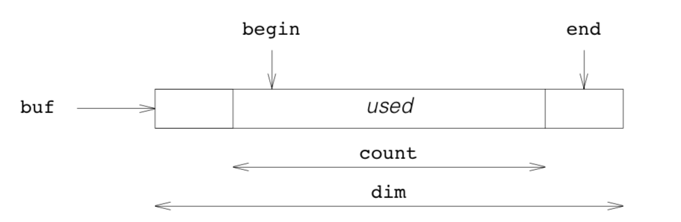

`begin`和`end`限定了列表里被使用的部分，`dim`是缓存区的最大值，`count`是目前缓冲区里的元素的个数。用`count`可以很容易区分一个缓冲区是满的还是空的。下面是类描述 *List.d*：

```
% ListClass: Class List: Object {
    const void ** buf;      // const void * buf [dim]
    unsigned dim;           // current buffer dimension
    unsigned count;         // # elements in buffer
    unsigned begin;         // index of takeFirst slot, 0..dim
    unsigned end;           // index of addLast slot, 0..dim
%
    Object @ addFirst (_self, const Object @ element);
    Object @ addLast (_self, const Object @ element);
    unsigned count (const _self);
    Object @ lookAt (const _self, unsigned n);
    Object @ takeFirst (_self);
    Object @ takeLast (_self);
%-                          // abstract, for Queue/Stack
    Object @ add (_self, const Object @ element);
    Object @ take (_self);
%}
```

*List.dc* 里的实现不是太难。构造函数提供了最初的缓冲区：

```
% List ctor {
    struct List * self = super_ctor(List, _self, app);
    
    if (! (self -> dim = va_arg(* app, unsigned)))
        self -> dim = MIN;
    self -> buf = malloc(self -> dim * sizeof * self -> buf);
    assert(self -> buf);
    return self;
}
```

正常情况下，用户会指定缓冲区的最小值。我们用一个合适的值把`MIN`定义为默认值。析构函数释放了缓冲区，但没有释放缓冲区里的元素。

```
% List dtor {
%casts
    free(self -> buf), self -> buf = 0;
    return super_dtor(List, self);
}
```

`addFirst()`和`addLast()`分别在开始和结尾处添加一个元素：

```
% List addFirst {
%casts
    if (! self -> count)
        return add1(self, element);
    extend(self);
    if (self -> begin == 0)
        self -> begin = self -> dim;
    self -> buf[-- self -> begin] = element;
    return (void *) element;
}

% List addLast {
%casts
    if (! self -> count)
        return add1(self, element);
    extend(self);
    if (self -> end >= self -> dim)
        self -> end = 0;
    self -> buf[self -> end ++] = element;
    return (void *) element;
}
```

两个函数共用了添加一个元素的代码：

```
static void * add1 (struct List * self, const void * element)
{
    self -> end = self -> count = 1;
    return (void *) (self -> buf[self -> begin = 0] = element);
}
```

不过，非变量是不同的：如果`count`不为零的话，即，缓冲区里要是有元素的话，`begin`指向一个元素，而`end`指向一个待填充的位置。每个值都刚刚超过缓冲区当前的范围。缓冲区是个环，所以我们在访问缓冲区之前先把变量放到对应的位置。`extend()`是难点所在：当空间用尽时，我们使用`realloc()`把缓冲区的大小加倍。

```
static void extend (struct List * self) // one more element
{
    if (self -> count >= self -> dim) 
    {   self -> buf = 
                realloc(self -> buf, 2 * self -> dim 
                        * sizeof * self -> buf);
        assert(self -> buf);
        if (self -> begin && self -> begin != self -> dim)
        {   memcpy(self -> buf + self -> dim + self -> begin,
                self -> buf + self -> begin, 
                (self -> dim — self -> begin) 
                        * sizeof * self -> buf);
            self -> begin += self -> dim;
        } else
            self -> begin = 0;
    }
    ++ self -> count;
}
```

`realloc()`复制`buf[]`里存的指针，但要是环不是从缓冲区的起始位置开始的话，我们就要用`memcpy()`把环的起始位置移到新缓冲区的末尾。

剩下的函数就简单很多了。`count()`就是一个简单的用于访问`count`的函数。`lookAt()`使用了一点算数技巧来返回环里合适的对象：

```
% List lookAt {
%casts
    return (void *) (n >= self -> count ? 0 : 
            self -> buf[(self -> begin + n) % self -> dim]);
}
```

`takeFirst()`和`takeLast()`只是简单地反转了相应的**添加**函数的不变量。下面是一个例子：

```
% List takeFirst {
%casts
    if (! self -> count)
        return 0;
    --self -> count;
    if (self -> begin >= self -> dim)
        self -> begin = 0;
    return (void *) self -> buf[self -> begin ++];
}
```

`takeLast()`留作练习——所有选择器和初始化函数也是。

`List`演示了 *ooc* 让我们回到了处理被作为一种数据类型的类的实现问题，而不是面向对象编程风格的一种特性。给定一个合适的类，我们可以轻松地派生出更多针对具体问题的类。`List`引入了动态链接方法`add()`和`take()`，以便子类可以限定访问规则。`Stack`在一端操作：

```
Stack.d
    % ListClass Stack: List {
    %}
Stack.dc
% Stack add {
    return addLast(_self, element);
}
% Stack take {
%}
%init
```

`Queue `可以从`Stack`派生并重写`take()`方法，或者它可以作为`List`的子类并定义这两个方法。`List`本身不定义动态链接的方法，所以被称作*抽象的基类*。我们的选择器很强大，因此我们能清楚地知道有人是在`List`上而不是在子类上用了`add()`和`take()`。下面是个测试程序，它演示了我们可以把普通的 C 字符串而非对象添加到`Stack`或`Queue`里。

```
#include "Queue.h"
int main (int argc, char ** argv) 
{   void * q;
    unsigned n;
    
    initQueue();
    q = new(Queue, 1);
    
    while (* ++ argv) 
        switch (** argv) {
        case ’+’:
            add(q, *argv + 1);
            break;
        case '-':
            puts((char *) take(q));
            break; default:
    n = count(q);
    while (n —— > 0)
    {   const void * p = take(q);
        puts(p), add(q, p); }
    } return 0;
}
```

如果命令行参数以 **+** 开始，它就被添加到队列里，是 **-** 的话就被移除。其他任何参数都会把列表内容显示出来：

```
$ queue +axel - +is +here . - . - . axel
is
here
is 
here
here
```

把`Stack`用`Queue`替换掉后，我们可以看到移除时顺序的不同：

```
$ stack +axel - +is +here . - . - .
axel
is
here
here
is
is
```

由于`Stack`是`List`的子类，有很多方法可以在不改变其内容的前提下展示栈里的内容，比如：

```
n = count(q);
while (n -- > 0)
{   const void * p = takeFirst(q);

    puts(p), addLast(q, p);
}
```

##### <a name="7.8">7.8 练习</a>

把`Queue`和`Point`与`Circle`结合在一起做一个具有重画能力的框架图形程序是个有趣的练习。

可以修改报表 **-r** 和 **include** 来实现 [4.6](#4.6) 里提到的不透明的结构。

可以修改 **init** 报表来生成一个展示`Class`的结构的方法。

选择器和父类选择器被 *etc.rep* 里的报表生成。可以修改它们来提供执行跟踪或试验各种级别的参数检查。

可以修改 *ooc* 命令脚本和 *main.awk* 与 *report.awk*，实现用 *-x* 参数来加载、解读和移除 *x.rep* 报表。有了这个修改之后，新报表 *flatten.rep* 可以展示一个类的所有可用的方法。
